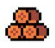
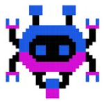
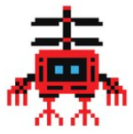
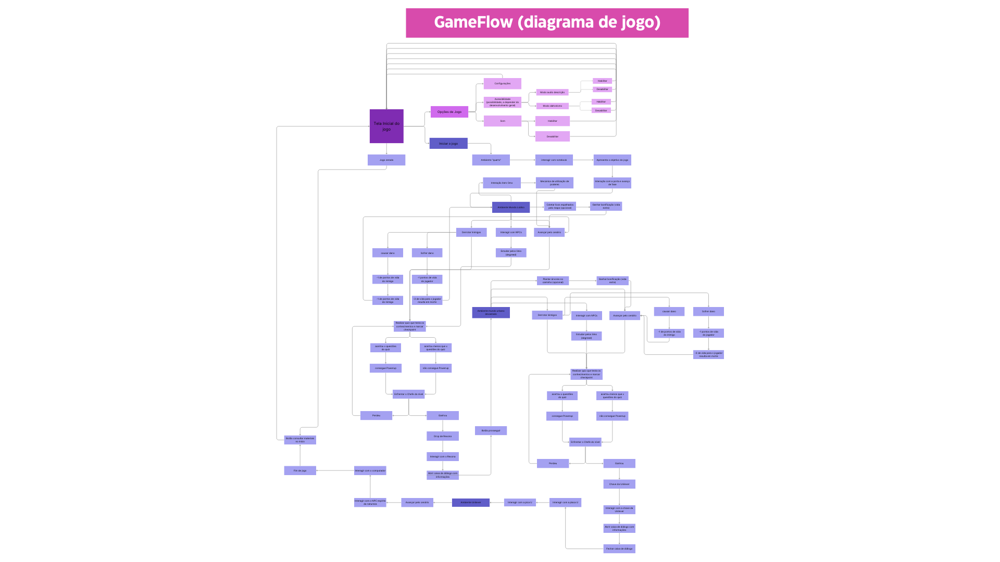

# GDD - Game Design Document - Módulo 1 - Inteli

**_Os trechos em itálico servem apenas como guia para o preenchimento da seção. Por esse motivo, não devem fazer parte da documentação final_**

## Nome do Grupo

#### Nomes dos integrantes do grupo

## Sumário

[1. Introdução](#c1)

[2. Visão Geral do Jogo](#c2)

[3. Game Design](#c3)

[4. Desenvolvimento do jogo](#c4)

[5. Casos de Teste](#c5)

[6. Conclusões e trabalhos futuros](#c6)

[7. Referências](#c7)

[Anexos](#c8)

 

# 1. Introdução (sprints 1 e 4)

## 1.1. Escopo do Projeto

### 1.1.1. Contexto da indústria (sprints 1 e 4)

*Unilever é uma empresa multinacional que possui mais de 400 marcas em mais de 190 países ao redor do mundo e está presente na vida de mais de 3,4 bilhões de pessoas com seus produtos diariamente. Essa indústria é uma das maiores no segmento de bens de consumo no mundo, possuindo cinco vertentes no mercado: alimentação, limpeza, produtos de higiene e produtos de cuidados pessoais. Entre as principais marcas estão: Omo, Dove, Doriana, Kibon, Hellmann 's, Rexona, Knorr-Cica, Lipton, Magnum, Comfort. Contudo, há corporações  multinacionais nesse ramo que competem o pódio, como a Procter & Gamble e a Nestlé.*

### 1.1.2. Análise SWOT (sprints 1 e 4)

*A análise SWOT é relacionada ao parceiro Unilever, a tabela foi feita a fim de realizar uma avaliação ambiental no âmbito estratégico, levando em consideração o contexto da indústria, ocorrências e as características do ambiente interno e externo da Unilever.*

### 1.1.3. Descrição da Solução Desenvolvida (sprints 1 e 4)

*A Unilever, apesar de sua posição como empresa líder global, identificou defasagens em seu processo de onboarding, notada na baixa absorção de informações críticas pelos novos colaboradores. A proposta de solução almeja reformular e gamificar o onboarding, incorporando elementos lúdicos para tornar a aprendizagem envolvente e significativa. 
A solução proposta será utilizada como uma ferramenta interativa e dinâmica, apresentando-se na forma de um jogo personalizado destinado a envolver ativamente os novos membros da empresa. Os benefícios almejados incluem aumento na retenção de informações, uma compreensão mais profunda da empresa e um alinhamento eficaz com os valores e objetivos da Unilever. O critério de sucesso será medido através de análises periódicas de desempenho, satisfação e engajamento, visando proporcionar uma transição positiva para o ambiente de trabalho da Unilever.*

### 1.1.4. Proposta de Valor (sprints 1 e 4)

*A proposta de valor descreve aspectos essenciais para criação de valor para o projeto, traçando o objetivo de melhor entender a realidade do parceiro e entregar uma solução alinhada com o que a Unilever espera.*

### 1.1.5. Matriz de Riscos (sprints 1 e 4)

*A matriz de risco demonstra os riscos observados no projeto pela equipe de desenvolvimento, representando ameaças e oportunidades, assim como impactos relevantes sobre o projeto. Em verde, estão indicados percalços que não necessitam de intervenção; em amarelo, pontos que apresentam média probabilidade e demandam certa atenção; e, em vermelho, estão destacados pontos críticos que devem ser evitados.*

## 1.2. Requisitos do Projeto (sprints 1 e 2)

*Posicione aqui a lista de requisitos levantados para o projeto, sejam pedidos do parceiro ou invenções do grupo. Descreva-os de forma objetiva, de modo que seja possível entender claramente como implementá-los tecnicamente.*

*Aqui, adicionamos alguns pontos que acreditamos que devem estar presentes em nosso projeto. Diante disso, enviamos esta tabela.*
\# | Requisito
--- | ---
1 | Recompensas de bonificação por responder perguntas relacionadas à Unilever 
2 | Os controles serão: seta cima, esquerda, baixo, direita, espaço D e F.
3 | HUB de direcionamento para trilhas específicas de Onboarding da Unilever
4 | Apresentação de informações públicas da empresa de forma gamificada
5 | O jogo será em 2D de plataforma
6 | Apresentação das mecânicas do Onboarding
7 | Mostrar o dicionário da Unilever
8 | O personagem perde uma vida toda vez que toca em um inimigo ou em algum projétil inimigo
9 | Mecânica de utilização de poderes
10 | Mundo lúdico - estilo mario
11 | dinâmica de plantar arvores
12 | realização de quiz
13 | Contato com plataformas Unilever (Uniops & degreed)
14 | mecânica de dash

## 1.3. Público-alvo do Projeto (sprint 2)

*Posicione aqui uma descrição justificada do público-alvo do jogo, em termos demográficos e de preferências/gostos pessoais.*

# 2. Visão Geral do Jogo (sprint 2)

## 2.1. Objetivos do Jogo (sprint 2)

*O jogador precisa derrotar inimigos pelo mapa, concluir o quiz e derrotar o chefão da fase, nos dois mundos disponíveis: Mundo Lúdico e Mundo Unilever. Desse modo, o jogador será capaz de concluir o jogo integralmente. Logicamente, conforme solicitado, nenhuma das partes anteriormente citadas será uma barreira para o colaborador completar o processo de integração.*

## 2.2. Características do Jogo (sprint 2)

### 2.2.1. Gênero do Jogo (sprint 2)

*O gênero do jogo é de plataforma e aventura.*  

### 2.2.2. Plataforma do Jogo (sprint 2)

*O jogo é feito para Desktop e será jogado na plataforma Web.*

### 2.2.3. Número de jogadores (sprint 2)

*O jogo é para apenas um jogador.*

### 2.2.4. Títulos semelhantes e inspirações (sprint 2)

*Entre as inspirações para o jogo, pode-se listar Sonic, Mario e Mega Man.*

### 2.2.5. Tempo estimado de jogo (sprint 5)

*Ex. O jogo pode ser concluído em 3 horas passando por todas as fases.*

*Ex. cada partida dura até 15 minutos*

# 3. Game Design (sprints 2 e 3)

## 3.1. Enredo do Jogo (sprints 2 e 3)

*Descreva o enredo/história do jogo, criando contexto para os personagens (seção 3.2) e o mundo do jogo (seção 3.3). Uma boa história costuma ter um arco narrativo de contexto, conflito e resolução. Utilize etapas sequenciais para descrever esta história.* 

*Caso seu jogo não possua enredo/história (ex. jogo Tetris), mencione os motivos de não existir e como o jogador pode se contextualizar com o ambiente do jogo.*

## 3.2. Personagens (sprints 2 e 3)

### 3.2.1. Controláveis

*O jogo contará apenas com 1 personagem controlável que terá variações de gênero e etnia. O personagem não tem nome nem rosto, ele deverá representar o funcionário da Unilever, portanto possui forma humana e tem como objetivo seguir as instruções dadas ao longo do enredo da história. Ao longo do game, o personagem receberá power-ups, que irão alterar suas roupas.*

### 3.2.2. Non-Playable Characters (NPC)

*O jogo contará com diversos NPCs pacíficos espalhados pelo mapa, que não terão nome, de acordo com o enredo serão apenas pessoas dispostas a ajudar o player. Ao interagir com os NPCs pacíficos, o jogador terá acesso a links e materiais sobre a Unilever. Ao longo do mapa terão 4 NPCs diferentes, com design parecido com o a seguir.*

### 3.2.3. Diversidade e Representatividade dos Personagens

*O jogo abordará a diversidade e representatividade dos personagens por meio de um sistema de seleção inicial no game, cujo o jogador poderá escolher o sprite de personagem com o qual ele se identifica. Para homens, terão 3 opções de etnia. Para mulher, também haverá 3 opções de etnia.
Segue alguns exemplos.*

## 3.3. Mundo do jogo (sprints 2 e 3)

### 3.3.1. Locações Principais e/ou Mapas (sprints 2 e 3)

*Descreva o ambiente do jogo, em que locais ele ocorre. Ilustre com imagens. Se houverem mapas, posicione-os aqui, descrevendo as áreas em acordo com o enredo. Se houverem fases, descreva-as também em acordo com o enredo (pode ser um jogo de uma fase só). Utilize listas ou tabelas para organizar esta seção. Caso utilize material de terceiros em licença Creative Commons, não deixe de citar os autores/fontes.*

### 3.3.2. Navegação pelo mundo (sprints 2 e 3)

*Descreva como os personagens se movem no mundo criado e as relações entre as locações – como as áreas/fases são acessadas ou desbloqueadas, o que é necessário para serem acessadas etc. Utilize listas ou tabelas para organizar esta seção.*

### 3.3.3. Condições climáticas e temporais (sprints 2 e 3)

*\<opcional\> Descreva diferentes condições de clima que podem afetar o mundo e as fases, se aplicável*

*Caso seja relevante, descreva como o tempo passa, se ele é um fator limitante ao jogo (ex. contagem de tempo para terminar uma fase)*

### 3.3.4. Concept Art (sprint 2)

*Inclua imagens de Concept Art do jogo que ainda não foram demonstradas em outras seções deste documento. Para cada imagem, coloque legendas, como no exemplo abaixo.*

Figura 1: detalhe da cena da partida do herói para a missão, usando sua nave

### 3.3.5. Trilha sonora (sprint 3)

*Descreva a trilha sonora do jogo, indicando quais músicas serão utilizadas no mundo e nas fases. Utilize listas ou tabelas para organizar esta seção. Caso utilize material de terceiros em licença Creative Commons, não deixe de citar os autores/fontes.*

*Exemplo de tabela*
\# | titulo | ocorrência | autoria
--- | --- | --- | ---
1 | tema de abertura | tela de início | própria
2 | tema de combate | cena de combate com inimigos comuns | Hans Zimmer
3 | ... 

## 3.4. Inventário e Bestiário (sprint 3)

### 3.4.1. Inventário

*\<opcional\> Caso seu jogo utilize itens ou poderes para os personagens obterem, descreva-os aqui, indicando títulos, imagens, meios de obtenção e funções no jogo. Utilize listas ou tabelas para organizar esta seção. Caso utilize material de terceiros em licença Creative Commons, não deixe de citar os autores/fontes.* 

*Exemplo de tabela*
\# | item |  | como obter | função | efeito sonoro
--- | --- | --- | --- | --- | ---
1 | moeda |  | há muitas espalhadas em todas as fases | acumula dinheiro para comprar outros itens | som de moeda
2 | madeira |  | há muitas espalhadas em todas as fases | acumula madeira para construir casas | som de madeiras
3 | ... 

### 3.4.2. Bestiário

*\<opcional\> Caso seu jogo tenha inimigos, descreva-os aqui, indicando nomes, imagens, momentos de aparição, funções e impactos no jogo. Utilize listas ou tabelas para organizar esta seção. Caso utilize material de terceiros em licença Creative Commons, não deixe de citar os autores/fontes.* 

*Exemplo de tabela*
\# | inimigo |  | ocorrências | função | impacto | efeito sonoro
--- | --- | --- | --- | --- | --- | ---
1 | robô terrestre |  |  a partir da fase 1 | ataca o personagem vindo pelo chão em sua direção, com velocidade constante, atirando parafusos | se encostar no inimigo ou no parafuso arremessado, o personagem perde 1 ponto de vida | sons de tiros e engrenagens girando
2 | robô voador |  | a partir da fase 2 | ataca o personagem vindo pelo ar, fazendo movimento em 'V' quando se aproxima | se encostar, o personagem perde 3 pontos de vida | som de hélice
3 | ... 

## 3.5. Gameflow (Diagrama de cenas) (sprint 2)

*Posicione aqui seu "storyboard de programação" - o diagrama de cenas do jogo. Indique, por exemplo, como o jogo começa, quais opções o jogador tem, como ele avança nas fases, quais as condições de 'game over', como o jogo reinicia. Seu diagrama deve representar as classes, atributos e métodos usados no jogo.*

## 3.6. Regras do jogo (sprint 3)

*Descreva aqui as regras do seu jogo: objetivos/desafios, meios para se conseguir alcançar*

*Ex. O jogador deve pilotar o carro e conseguir terminar a corrida dentro de um minuto sem bater em nenhum obstáculo.*

*Ex. O jogador deve concluir a fase dentro do tempo, para obter uma estrela. Se além disso ele coletar todas as moedas, ganha mais uma estrela. E se além disso ele coletar os três medalhões espalhados, ganha mais uma estrela, totalizando três. Ao final do jogo, obtendo três estrelas em todas as fases, desbloqueia o mundo secreto.*  

## 3.7. Mecânicas do jogo (sprint 3)

*Descreva aqui as formas de controle e interação que o jogador tem sobre o jogo: quais os comandos disponíveis, quais combinações de comandos, e quais as ações consequentes desses comandos. Utilize listas ou tabelas para organizar esta seção.*

*Ex. Em um jogo de plataforma 2D para desktop, o jogador pode usar as teclas WASD para mecânicas de andar, mirar para cima, agachar, e as teclas JKL para atacar, correr, arremesar etc.*

*Ex. Em um jogo de puzzle para celular, o jogador pode tocar e arrastar sobre uma peça para movê-la sobre o tabuleiro, ou fazer um toque simples para rotacioná-la*

# 4. Desenvolvimento do Jogo

## 4.1. Desenvolvimento preliminar do jogo (sprint 1)

*Descreva e ilustre aqui o desenvolvimento da sua primeira versão do jogo, explicando brevemente o que foi entregue em termos de código e jogo. Utilize prints de tela para ilustrar. Indique as eventuais dificuldades e próximos passos.*

## 4.2. Desenvolvimento básico do jogo (sprint 2)

*Descreva e ilustre aqui o desenvolvimento da versão básica do jogo, explicando brevemente o que foi entregue em termos de código e jogo. Utilize prints de tela para ilustrar. Indique as eventuais dificuldades e próximos passos.*

## 4.3. Desenvolvimento intermediário do jogo (sprint 3)

*Descreva e ilustre aqui o desenvolvimento da versão intermediária do jogo, explicando brevemente o que foi entregue em termos de código e jogo. Utilize prints de tela para ilustrar. Indique as eventuais dificuldades e próximos passos.*

## 4.4. Desenvolvimento final do MVP (sprint 4)

*Descreva e ilustre aqui o desenvolvimento da versão final do jogo, explicando brevemente o que foi entregue em termos de MVP. Utilize prints de tela para ilustrar. Indique as eventuais dificuldades e planos futuros.*

## 4.5. Revisão do MVP (sprint 5)

*Descreva e ilustre aqui o desenvolvimento dos refinamentos e revisões da versão final do jogo, explicando brevemente o que foi entregue em termos de MVP. Utilize prints de tela para ilustrar.*

# 5. Testes (sprint 4)

## 5.1. Casos de Teste

*Descreva nesta seção os casos de teste comuns que podem ser executados a qualquer momento para testar o funcionamento e integração das partes do jogo. Utilize tabelas para facilitar a organização.*

*Exemplo de tabela*
\# | pré-condição do teste | o que ocorre no teste | resultado esperado do teste
--- | --- | --- | --- 
1 | Abrir tela inicial do jogo | Clicar no botão “play” | Iniciar cena 1
2 | Abrir tela inicial do jogo | Clicar no botão “som” | Silenciar som do jogo
3 | Posicionar personagem em frente ao notebook | Apertar tecla de interação com o notebook | Abrir diálogo na plataforma teams
4 | Posicionar o personagem em frente ao Rexona | Apertar tecla de interação com o Rexona | Pegar o item Rexona
5 | Posicionar o personagem em frente à porta do quarto | Passar pela porta do quarto | Encerrar cena e Iniciar cena 2
 

## 5.2. Testes de jogabilidade (playtests) (sprint 4)

### 5.2.1 Registros de testes

*Descreva nesta seção as sessões de teste/entrevista com diferentes jogadores. Registre cada teste conforme o template a seguir.*

Nome | João Jonas (use nomes fictícios)
--- | ---
Já possuía experiência prévia com games? | sim, é um jogador casual
Conseguiu iniciar o jogo? | sim
Entendeu as regras e mecânicas do jogo? | entendeu as regras, mas sobre as mecânicas, apenas as essenciais, não explorou os comandos complexos
Conseguiu progredir no jogo? | sim, sem dificuldades  
Apresentou dificuldades? | Não, conseguiu jogar com facilidade e afirmou ser fácil
Que nota deu ao jogo? | 9.0
O que gostou no jogo? | Gostou  de como o jogo vai ficando mais difícil ao longo do tempo sem deixar de ser divertido
O que poderia melhorar no jogo? | A responsividade do personagem aos controles, disse que havia um pouco de atraso desde o momento do comando até a resposta do personagem

### 5.2.2 Melhorias

*Descreva nesta seção um plano de melhorias sobre o jogo, com base nos resultados dos testes de jogabilidade*

# 6. Conclusões e trabalhos futuros (sprint 5)

*Escreva de que formas a solução do jogo atingiu os objetivos descritos na seção 1 deste documento. Indique pontos fortes e pontos a melhorar de maneira geral.*

*Relacione os pontos de melhorias evidenciados nos testes com plano de ações para serem implementadas no jogo. O grupo não precisa implementá-las, pode deixar registrado aqui o plano para futuros desenvolvimentos.*

*Relacione também quaisquer ideias que o grupo tenha para melhorias futuras*

# 7. Referências (sprint 5)

_Incluir as principais referências de seu projeto, para que seu parceiro possa consultar caso ele se interessar em aprofundar. Um exemplo de referência de livro e de site:_ 

LUCK, Heloisa. Liderança em gestão escolar. 4. ed. Petrópolis: Vozes, 2010.  
SOBRENOME, Nome. Título do livro: subtítulo do livro. Edição. Cidade de publicação: Nome da editora, Ano de publicação.  

INTELI. Adalove. Disponível em: https://adalove.inteli.edu.br/feed. Acesso em: 1 out. 2023  
SOBRENOME, Nome. Título do site. Disponível em: link do site. Acesso em: Dia Mês Ano

# Anexos

*Inclua aqui quaisquer complementos para seu projeto, como diagramas, imagens, tabelas etc. Organize em sub-tópicos utilizando headings menores (use ## ou ### para isso)*
