# GDD - Game Design Document - Módulo 1 - Inteli

## Preserverance Games

<a href="https://pixabay.com/music/acoustic-group-acoustic-folk-music-guitar-141345/">David Deodato</a>, <a href="https://pixabay.com/music/acoustic-group-acoustic-folk-music-guitar-141345/">Igor Sampaio</a>, <a href="https://pixabay.com/music/acoustic-group-acoustic-folk-music-guitar-141345/">Marlos Guedes</a>, <a href="https://pixabay.com/music/acoustic-group-acoustic-folk-music-guitar-141345/">Otávio Vasconcelos</a>, <a href="https://pixabay.com/music/acoustic-group-acoustic-folk-music-guitar-141345/">Raphael Silva</a>, <a href="https://pixabay.com/music/acoustic-group-acoustic-folk-music-guitar-141345/">Ricardo Planas</a> e <a href="https://pixabay.com/music/acoustic-group-acoustic-folk-music-guitar-141345/">Thiago Volcati</a>

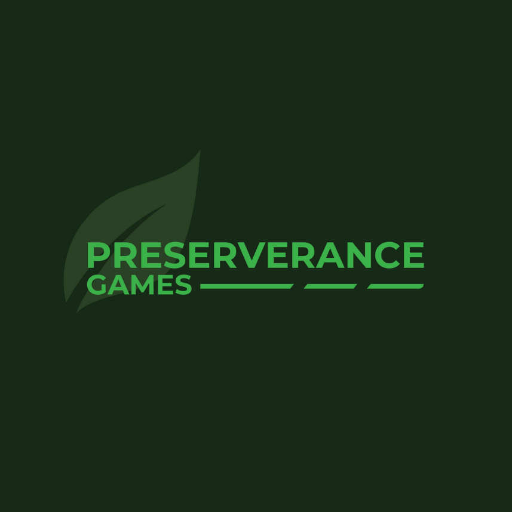

## Sumário

[1. Introdução](#c1)

[2. Visão Geral do Jogo](#c2)

[3. Game Design](#c3)

[4. Desenvolvimento do jogo](#c4)

[5. Casos de Teste](#c5)

[6. Conclusões e trabalhos futuros](#c6)

[7. Referências](#c7)

[Anexos](#c8)

 

# 1. Introdução

## 1.1. Escopo do Projeto

### 1.1.1. Contexto da indústria

&nbsp;&nbsp;&nbsp;&nbsp;Unilever é uma empresa multinacional que possui mais de 400 marcas em mais de 190 países ao redor do mundo e está presente na vida de mais de 3,4 bilhões de pessoas com seus produtos diariamente. Essa indústria é uma das maiores no segmento de bens de consumo no mundo, possuindo cinco vertentes no mercado: alimentação, limpeza, produtos de higiene e produtos de cuidados pessoais. Entre as principais marcas estão: Omo, Dove, Doriana, Kibon, Hellmann 's, Rexona, Knorr-Cica, Lipton, Magnum, Comfort. Contudo, há corporações  multinacionais nesse ramo que competem o pódio, como a Procter & Gamble e a Nestlé.

### 1.1.2. Análise SWOT

&nbsp;&nbsp;&nbsp;&nbsp;A análise SWOT é relacionada ao parceiro Unilever, a tabela foi feita a fim de realizar uma avaliação ambiental no âmbito estratégico, levando em consideração o contexto da indústria, ocorrências e as características do ambiente interno e externo da Unilever.

Figura 1 - Análise SWOT
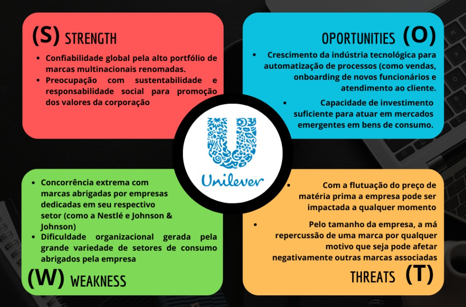
Fonte: Material produzido pelos autores (2024)

### 1.1.3. Descrição da Solução Desenvolvida

&nbsp;&nbsp;&nbsp;&nbsp;A Unilever, apesar de sua posição como empresa líder global, identificou defasagens em seu processo de onboarding, notada na baixa absorção de informações críticas pelos novos colaboradores. A proposta de solução almeja reformular e gamificar o onboarding, incorporando elementos lúdicos para tornar a aprendizagem envolvente e significativa.
A solução proposta será utilizada como uma ferramenta interativa e dinâmica, apresentando-se na forma de um jogo personalizado destinado a envolver ativamente os novos membros da empresa. Os benefícios almejados incluem aumento na retenção de informações, uma compreensão mais profunda da empresa e um alinhamento eficaz com os valores e objetivos da Unilever. O critério de sucesso será medido através de análises periódicas de desempenho, satisfação e engajamento, visando proporcionar uma transição positiva para o ambiente de trabalho da Unilever.

### 1.1.4. Proposta de Valor

&nbsp;&nbsp;&nbsp;&nbsp;A proposta de valor descreve aspectos essenciais para criação de valor para o projeto, traçando o objetivo de melhor entender a realidade do parceiro e entregar uma solução alinhada com o que a Unilever espera.

Figura 2 - Proposta de Valor
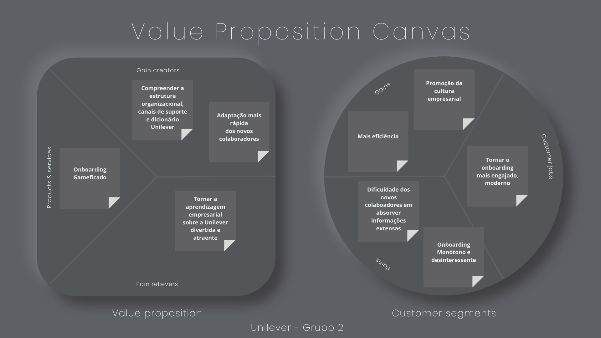
Fonte: Material produzido pelos autores (2024)

&nbsp;&nbsp;&nbsp;&nbsp; Na seção "Proposta de Valor", há três componentes principais:

&nbsp;&nbsp;&nbsp;&nbsp; *Produtos e Serviços:* Apresenta a ideia de "Onboarding Gamificado", sugerindo um processo de integração que usa elementos de jogos.

&nbsp;&nbsp;&nbsp;&nbsp; *Criadores de Ganho:* Detalha como o onboarding gamificado pode ajudar a compreender a estrutura organizacional, canais de suporte e o "dicionário" Unilever. Este ponto esta direcionado a facilitar a adaptação dos novos colaboradores e tornar o aprendizado sobre a empresa mais divertido e atraente.

&nbsp;&nbsp;&nbsp;&nbsp; *Aliviadores de Dor:* Enfatiza a importância de tornar a aprendizagem empresarial divertida e atraente para aliviar a dificuldade dos novos colaboradores em absorver informações extensas.

&nbsp;&nbsp;&nbsp;&nbsp; Na seção "Segmentos de Clientes", também existem três componentes:

&nbsp;&nbsp;&nbsp;&nbsp; *Trabalhos do Cliente:* Fala sobre a necessidade de promover a cultura empresarial e tornar o onboarding mais engajado e moderno.

&nbsp;&nbsp;&nbsp;&nbsp; *Ganhos:* Destaca a busca por mais eficiência.

&nbsp;&nbsp;&nbsp;&nbsp; *Dores:* Menciona como o onboarding monótono e desinteressante pode ser um obstáculo, possivelmente levando a uma dificuldade dos novos colaboradores em absorver informações.

### 1.1.5. Matriz de Riscos

&nbsp;&nbsp;&nbsp;&nbsp;A matriz de risco demonstra os riscos observados no projeto pela equipe de desenvolvimento, representando ameaças e oportunidades, assim como impactos relevantes sobre o projeto. Em verde, estão indicados percalços que não necessitam de intervenção; em amarelo, pontos que apresentam média probabilidade e demandam certa atenção; e, em vermelho, estão destacados pontos críticos que devem ser evitados.

Figura 3 - Matriz de Riscos
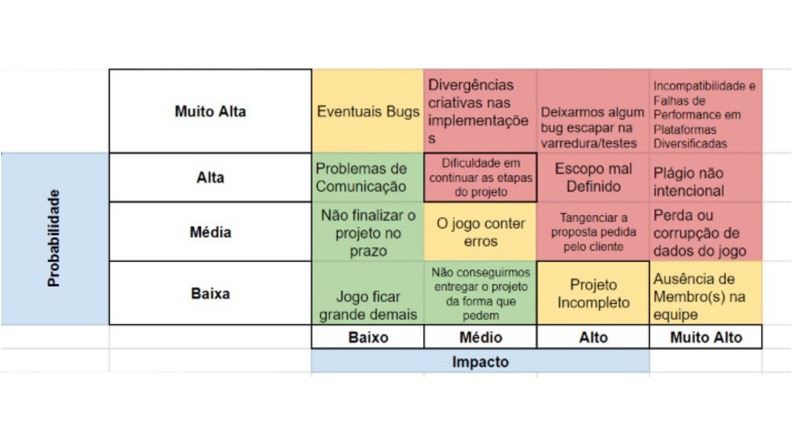
Fonte: Material produzido pelos autores (2024)

### 1.1.6. 5 Forças de Porter

#### Obstáculos para novos entrantes:
&nbsp;&nbsp;&nbsp;&nbsp;A indústria na qual a Unilever opera apresenta barreiras significativas à entrada, incluindo altos custos de capital para produção e distribuição, exigências regulatórias estritas, e a necessidade de estabelecer uma forte marca e rede de distribuição. A Unilever beneficia-se de economias de escala e de um portfólio de marcas bem estabelecido que são reconhecidas e confiáveis pelos consumidores.

#### Impacto dos novos entrantes: 
&nbsp;&nbsp;&nbsp;&nbsp;Embora haja barreiras significativas, o surgimento de novos entrantes focados em nichos de mercado ou inovações, especialmente no segmento de produtos orgânicos e sustentáveis, pode desafiar a posição da Unilever. Contudo, o impacto potencial é moderado devido à forte presença de mercado e capacidade de inovação da Unilever.

#### Produtos ou serviços substitutos relevantes: 
&nbsp;&nbsp;&nbsp;&nbsp;Existem diversos produtos substitutos nos segmentos em que a Unilever atua, desde marcas locais até alternativas orgânicas e naturais. A tendência crescente de conscientização sobre saúde e sustentabilidade tem impulsionado a procura por esses substitutos.

#### Nível de ameaça dos substitutos: 
&nbsp;&nbsp;&nbsp;&nbsp;A ameaça é considerável, especialmente com a crescente preocupação dos consumidores com a sustentabilidade e ingredientes naturais. A Unilever tem respondido por meio do desenvolvimento de produtos mais sustentáveis e através de aquisições estratégicas de marcas neste segmento.

#### Principais fornecedores da indústria:

&nbsp;&nbsp;&nbsp;&nbsp;A Unilever lida com uma ampla gama de fornecedores, incluindo produtores de matérias-primas, embalagens, e serviços de logística.

#### Poder de barganha dos fornecedores:

&nbsp;&nbsp;&nbsp;&nbsp; O poder de barganha dos fornecedores é moderado. A Unilever, devido ao seu tamanho e volume de compras, consegue exercer uma negociação favorável em muitos casos. No entanto, para ingredientes específicos ou tecnologias patenteadas, os fornecedores podem ter maior poder de barganha.

#### Principais tipos de clientes da indústria:

&nbsp;&nbsp;&nbsp;&nbsp; Os clientes da Unilever variam desde grandes varejistas e supermercados até consumidores individuais.

#### Poder de barganha dos clientes:

&nbsp;&nbsp;&nbsp;&nbsp; O poder de barganha dos clientes é significativo, especialmente dos grandes varejistas que podem negociar preços melhores devido ao volume de compra. Os consumidores individuais têm poder limitado, mas influenciam a empresa através das preferências de consumo e tendências.

#### Principais concorrentes na indústria:

&nbsp;&nbsp;&nbsp;&nbsp; A Unilever compete com outras multinacionais como Procter & Gamble, Nestlé, e L'Oréal, além de diversas empresas locais e regionais.

#### Nível de rivalidade:

&nbsp;&nbsp;&nbsp;&nbsp;A rivalidade na indústria é alta, com competição intensa em inovação, marketing, e expansão para novos mercados. A Unilever mantém sua competitividade através de inovação constante, diversificação de produtos, e sustentabilidade como parte de sua estratégia de negócios.

## 1.2. Requisitos do Projeto

\# | Requisito
--- | ---
1 | Recompensas por responder perguntas relacionadas à Unilever
2 | Os controles serão: seta cima, esquerda, baixo, direita, Q W e E
3 | HUB de direcionamento para trilhas específicas de Onboarding da Unilever
4 | Apresentação de informações públicas da empresa de forma gamificada
5 | O jogo será em 2D de plataforma
6 | Apresentação das mecânicas do Onboarding
7 | Mostrar o dicionário da Unilever
8 | O personagem perde uma vida toda vez que toca em um inimigo ou em algum projétil inimigo
9 | Mecânica de utilização de poderes
10 | Mundo lúdico - estilo Mario
11 | Realização de quiz
12 | Contato com plataformas Unilever (Uniops & degreed)
13 | Mecânica de dash

## 1.3. Público-alvo do Projeto

Nosso público alvo são pessoas com perfil médio de estagiários na Unilever, na faixa etária média de 24 anos, com formação acadêmica conectada à área de tecnologia

# 2. Visão Geral do Jogo

## 2.1. Objetivos do Jogo

&nbsp;&nbsp;&nbsp;&nbsp;O jogador precisa derrotar inimigos pelo mapa, concluir trilhas de treinamento da Unilever, os quizzes e derrotar o chefão da fase, nas duas cenas de combate. Desse modo, o jogador será capaz de concluir o jogo integralmente. Conforme solicitado, nenhuma das partes anteriormente citadas (exceto trilhas obrigatórias e quizzes) será uma barreira para o colaborador completar o processo de integração.

## 2.2. Características do Jogo

### 2.2.1. Gênero do Jogo

&nbsp;&nbsp;&nbsp;&nbsp;O gênero do jogo é de plataforma e aventura. O gênero de plataforma consiste em movimentar seu personagem através do ambiente no qual jogo acontece. O Gênero de aventura, por sua vez, são jogos nos quais o jogador assume o lugar de protagonista e tem como objetivo explorar o ambiente interativamente e concluir quebra-cabeças.

### 2.2.2. Plataforma do Jogo

&nbsp;&nbsp;&nbsp;&nbsp;O jogo é feito para Desktop e será jogado na plataforma Web. Como indicado pelo termo de abertura do projeto e reafirmado pelos parceiros durante as sprints, a opção pela plataforma web desktop está mais alinhada com a proposta e objetivos definidos para o projeto.

### 2.2.3. Número de jogadores

&nbsp;&nbsp;&nbsp;&nbsp;Devido a indicação do parceiro e, as limitações provenientes das escolhas pela plataforma web e sem ligação com os servidores da empresa, o jogo será individual, por buscando salientar o desenvolvimento individual de cada colaborador.

### 2.2.4. Títulos semelhantes e inspirações

&nbsp;&nbsp;&nbsp;&nbsp;Entre as inspirações para o jogo, pode-se listar Sonic, Mario e Mega Man. As escolhas decorrem do fato de que os jogos citados pertencem aos mesmos gêneros do jogo criado, tendo como base a movimentação em duas dimensões, arte em pixel e a temática de aventura. Além disso, os jogos em questão revolucionaram suas época ao trazer inovação, originalidade, simplicidade e valores igualmente desenvolvidos neste projeto.

### 2.2.5. Tempo estimado de jogo

*Ex. O jogo pode ser concluído em 3 horas passando por todas as fases.*

*Ex. cada partida dura até 15 minutos*

# 3. Game Design

## 3.1. Enredo do Jogo

&nbsp;&nbsp;&nbsp;&nbsp;Você acorda, está se preparando para o primeiro dia na Unilever, mas nota algo diferente, o mundo no qual a harmonia é mantida pela energia vital da natureza balanceada pela Unilever está sendo abalado, pois as principais marcas foram roubadas por vilões tenebrosos. Agora, você precisará batalhar com eles para recuperar as principais marcas e restaurar o equílibro. Os vilões por trás disso tudo são o "Rei do Desmatamento" e o "Rei da Poluição". Estes vilões, acompanhados por seus monstros, espalham o caos, sujeira e a destruição, poluindo e destruindo a natureza e ameaçando a vida de todas as criaturas que habitam esse mundo, incluindo a você. E agora? Devolva as marcas para Unilver para salvar o mundo!

&nbsp;&nbsp;&nbsp;&nbsp;Cena 0 - Tela de Título
Descrição: Tela simples de título com botão play, idioma atual e som.

&nbsp;&nbsp;&nbsp;&nbsp;Cena 1 - Seletor de personagem

&nbsp;&nbsp;&nbsp;&nbsp;Tela simples para que o jogador selecione seu personagem com o mouse.

&nbsp;&nbsp;&nbsp;&nbsp;Cena 2 - Tutorial dos Comandos básicos

&nbsp;&nbsp;&nbsp;&nbsp;Tela simples para que o jogador seja introduzido aos comandos básicos do jogo, como movimentação, interação e pulos.

&nbsp;&nbsp;&nbsp;&nbsp;Cena 3 - Quarto

&nbsp;&nbsp;&nbsp;&nbsp; Descrição: Quarto do personagem com um computador e um Rexona (*Power-up*) interativo.

&nbsp;&nbsp;&nbsp;&nbsp;O personagem irá acordar em seu aconchegante quarto, tendo como objetivo interagir com o computador. No dispositivo, ele será instroduzido a experiência de uso do Microsoft Teams, onde sua diretora o dará a missão de recuperar as marcas e lhe dará uma das marcas que sobraram para ajuda-lo em sua caminhada.

&nbsp;&nbsp;&nbsp;&nbsp;Fala da diretora:

'Diretora: Olá, colaborador, seja bem vindo a Unilever!',
'Diretora: Aqui na Unilever utilizamos o Microsoft Teams como principal forma de comunicação remota.'
'Diretora: Vilões tenebrosos roubaram algumas de nossas marcas, e por conta disso, não estamos mais conseguindo manter o equilíbrio da Unilever.'
'Diretora: Iremos te enviar uma das nossas marcas para você conseguir enfrentar os desafios a frente sem nem suar'
'Diretora: Contamos com você, herói, ajude-nos a recuperar nossas marcas e reestruturar a empresa'

&nbsp;&nbsp;&nbsp;&nbsp;Em seguida, o personagem seguirá pela cena e deverá interagir com o Rexona.

&nbsp;&nbsp;&nbsp;&nbsp;Iniciará o o primeiro quiz do jogo, somente para aprendizado do funcionamento do quiz e validação dos comandos, feitos com o mouse

&nbsp;&nbsp;&nbsp;&nbsp;Cena 4 - Cenário combate 1

&nbsp;&nbsp;&nbsp;&nbsp;O personagem sai do quarto e se depara com um mundo lúdico ao estilo Super Mario. Para avançar na fase, ele deve seguir para direita e derrotar os inimigos com o poder do Rexona. Ao longo da fase, estarão espalhados 2 NPCs que são obrigatórios para prosseguir na fase. Quando o jogador interagir com eles, terá acesso aos links disponibilizados pela Unilever, e só poderá prosseguir no jogo após clicar nos links oferecidos pelos NPCs e responder os quizzes corretamente.

&nbsp;&nbsp;&nbsp;&nbsp;Perto do fim da fase, haverá um *checkpoint* junto a um hub de links (representado por um NPC), que vai disponibilizar as trilhas Unilever, a fim de que o colaborador aprenda as principais ferramentas utilizadas dentro da empresa. Depois disso, ele poderá prosseguir na fase e enfrentar o *boss* “Rei da poluição”. Caso ele perca para o rei, irá renascer no *checkpoint* e vai pode enfrentar novamente quantas vezes forem necessárias para vencê-lo. O dano desferido é acumulado, garantindo que o colaborador consiga derrotá-lo. Após vencer o *boss*, ele soltará um item “Omo” e, ao interagir com o item, o jogador deverá responder um quiz sobre o conteúdo estudado nas trilhas. Caso ele acerte todas as questões, obterá o *Power-up* e receberá a transformação de “Super Omo”, assim podendo avançar para a próxima fase. Porém, caso não consiga concluir o questionário, ele deve realizar o quiz novamente, até que obtenha êxito.

&nbsp;&nbsp;&nbsp;&nbsp;Para finalizar a fase, o jogador deverá prosseguir até o ônibus que vai levar ele até o próximo mapa.

&nbsp;&nbsp;&nbsp;&nbsp;Cena 5 - Exploração urbana combate 2

&nbsp;&nbsp;&nbsp;&nbsp;Agora o personagem se encotra em um cenário urbano. Para avançar na fase, ele deve seguir para direita e derrotar os inimigos, agora mais poderosos. Perto do final da fase, terá novamente um hub de links (representado por um NPC), que disponibilizará links com outros materiais da Unilever, onde o jogador aprenderá mais conteúdos providos pela Unilever, obrigatórios para prosseguir na fase. Essa plataforma em que o NPC está vai ser um *checkpoint*, assim como no nível anterior.

&nbsp;&nbsp;&nbsp;&nbsp;No fim da fase, o jogador vai enfrentar o *boss* “Rei da Poluição”. Caso ele perca, irá retornar ao *checkpoint* e enfrentará novamente o *boss*, quantas vezes forem necessárias e também com dano cumulativo. Quando o jogador suceder, o rei deverá soltar o item “Kibon”, que ao ser coletado transformará o jogador no “Super Kibon”, adicionando o *dash*/avanço rápido, uma nova mecânica de movimentação do jogador. Para coletar esse item, o colaborador deve responder um quiz com perguntas sobre os conteúdos. Se ele não conseguir, deverá completar o quiz novamente, até o faça.

&nbsp;&nbsp;&nbsp;&nbsp;Cena 6 - Dentro da Unilever

&nbsp;&nbsp;&nbsp;&nbsp;O personagem se encontra agora na Unilever. Assim como nas outras fases, ele deve seguir para direita e, com o *power-up* da Kibon, o personagem deve utilizar o *dash*/avanço rápido para se movimentar, permitindo que ele alcance as plataformas mais distantes. Ao longo da fase, não há NPCs, a fim de instigar dúvidas no jogador, asism como não existem pontos de interação pelo mapa.

&nbsp;&nbsp;&nbsp;&nbsp;No fim da fase, o jogador encontrará a diretora. Ao conversar com o NPC se iniciará o seguinte diálogo:

'Diretora: Incrível, você conseguiu, herói! Bem-vindo à Unilever!',
'Diretora: Graças a sua coragem e determinação, todas as nossas marcas foram recuperadas.',
'Diretora: Você não apenas restaurou o equilíbrio da Unilever, mas também reforçou nossa união e resiliência como equipe.',
'Diretora: Seu feito vai além de apenas recuperar as marcas; você inspirou a todos nós a sermos melhores e mais fortes juntos.',
'Diretora: Em nome de toda a equipe Unilever, eu gostaria de expressar nossa mais profunda gratidão. Você é um verdadeiro herói para nós.',
'Diretora: Vamos continuar a comunicar e colaborar pelo Microsoft Teams. Quem sabe que novas aventuras nos aguardam?',
'Diretora: Por agora, celebre, herói! Você mais do que merece. Estamos ansiosos para vê-lo brilhar ainda mais no futuro.'

&nbsp;&nbsp;&nbsp;&nbsp;A fase e o jogo se encerram com o recebimento de uma tela de congratulações ao jogador pelo seu empenho e conquistas.

## 3.2. Personagens

### 3.2.1. Controláveis

&nbsp;&nbsp;&nbsp;&nbsp;O jogo contará apenas com 1 personagem controlável que terá variações de gênero e etnia. O personagem não tem nome nem rosto, ele deverá representar o funcionário da Unilever, portanto possui forma humana e tem como objetivo seguir as instruções dadas ao longo do enredo da história. Ao longo do jogo, o personagem receberá poderes, que irão alterar sua vestimenta.

### 3.2.2. Non-Playable Characters (NPC)

&nbsp;&nbsp;&nbsp;&nbsp;O jogo contará com diversos NPCs pacíficos espalhados pelo mapa, que não terão nome, de acordo com o enredo serão apenas pessoas dispostas a ajudar o jogador. Ao interagir com os NPCs, o personagem terá acesso a links e materiais sobre a Unilever. Ao longo do mapa terão 2 NPCs diferentes, com o design a seguir:

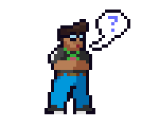
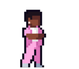

### 3.2.3. Diversidade e Representatividade dos Personagens

&nbsp;&nbsp;&nbsp;&nbsp;O jogo abordará a diversidade e representatividade dos personagens por meio de um sistema de seleção inicial no jogo, no qual o jogador poderá escolher o sprite de personagem com o qual ele se identifica. Tanto para os semblantes masculinos, quanto para os femininos, haveram 2 opções de etnia.

Figura 4 - Ilustração do ambiente Quarto
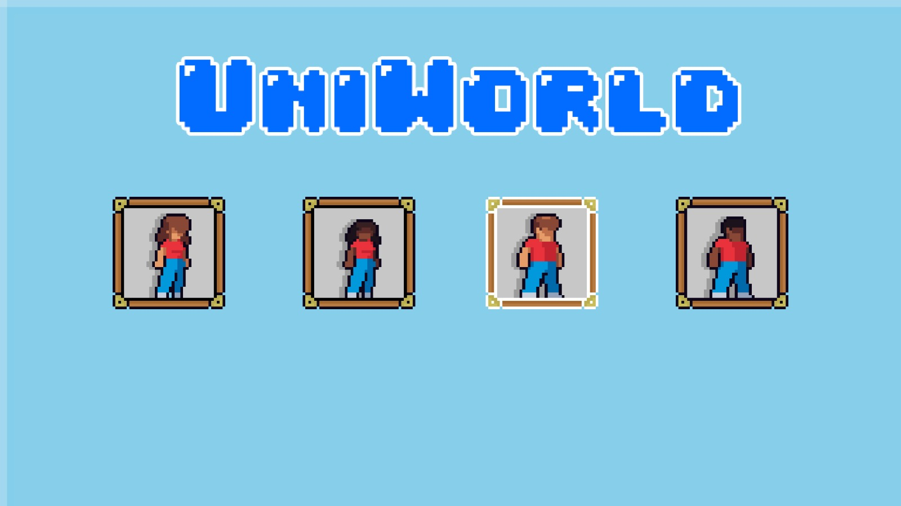
Fonte: Material produzido pelos autores (2024)

## 3.3. Mundo do jogo

### 3.3.1. Locações Principais e/ou Mapas

&nbsp;&nbsp;&nbsp;&nbsp;A cena inicial do jogo será no quarto, ambiente no qual é possível encontrar objetos como uma cama, guarda-roupas, mesa, janelas, um quadro e os itens principais deste ambiente: o desodorante Rexona e um notebook. O personagem irá acordar no ambiente em questão e irá interagir com um notebook que, dentro dele, encontrará informações sobre as plataformas que são utilizadas na empresa. No computador, após utilizar a ferramenta do Teams, entrará numa reunião onde receberá a missão de chegar a Unilever (figura 1).

Figura 1 - Ilustração do ambiente Quarto
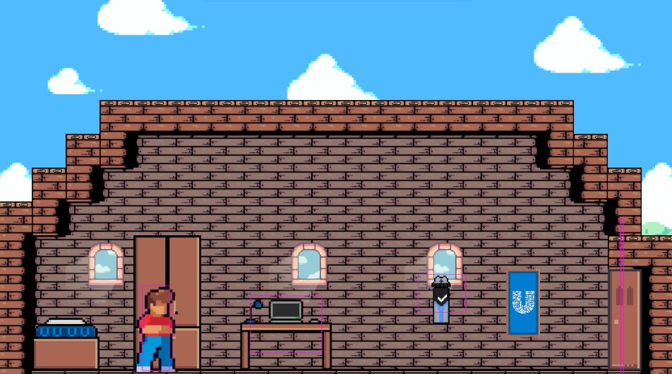
Fonte: Material produzido pelos autores (2024)

&nbsp;&nbsp;&nbsp;&nbsp;O segundo ambiente é o Mundo Lúdico, onde o Player terá da fato a primeira gameplay do jogo, nessa fase, é possivel encontrar objetos de decoração relacionados à Unilever, será possível batalhar contra inimigos e no final da fase um "chefão". O objetivo do Player nessa fase é interagir com o NPC que disponibiliza dos Links de aprendizado da Unilever e depois interagir com o objeto de Quiz que lhe dará o *Power-up* baseado no resultado. Depois de derrotar o primeiro chefe, pode seguir para o terceiro ambiente

Figura 2 - Ilustração do Mundo Lúdico
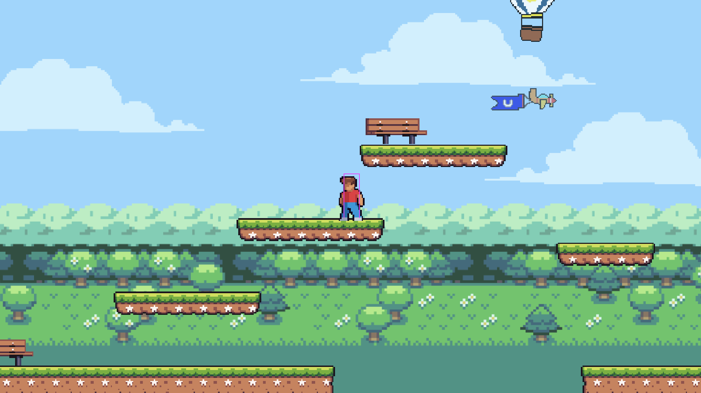
Fonte: Material produzido pelos autores (2024)
Figura 3 - Ilustração NPC do Hub de Links
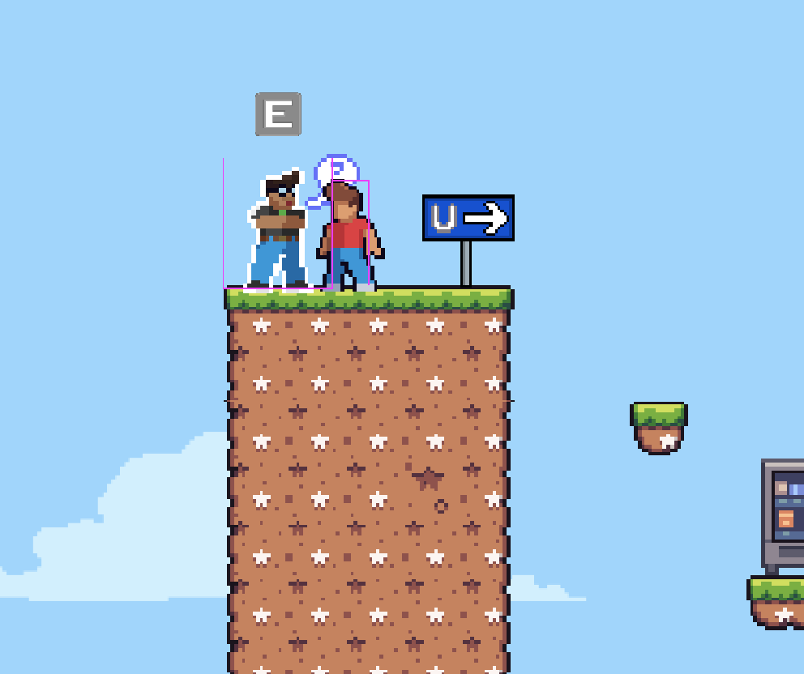
Fonte: Material produzido pelos autores (2024)
Figura 4 - Ilustração do Hub de Links
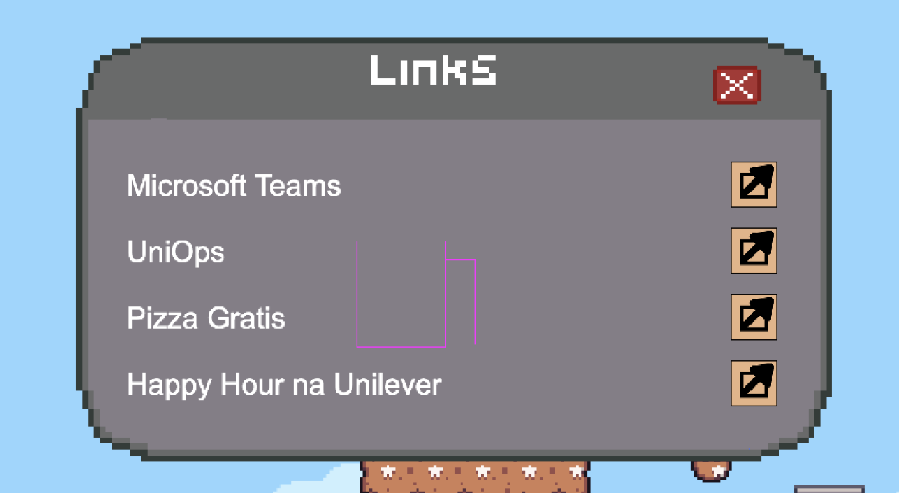
Fonte: Material produzido pelos autores (2024)

### 3.3.2. Navegação pelo mundo

&nbsp;&nbsp;&nbsp;&nbsp;O personagem controlável tem a possibilidade de mover-se no eixo X, fazendo com que seja intuitivo a linearidade de avanço da história, cujo seguir para direita indica avanço. Ademais, o personagem tem a possibilidade de se deslocar no eixo Y, mas retornando sempre para o ponto inicial neste eixo após algum tempo, simulando uma mecânica de pulo. Além disso, as fases são desbloqueadas conforme conclusão dos objetivos de cada fase, que consiste em, até o momento, completar um quiz ou derrotar determinado inimigo. A progressão em questão acontece naturalmente, ao decorrer do jogo e sem grandes dificuldades para o jogador.

### 3.3.3. Condições climáticas e temporais

&nbsp;&nbsp;&nbsp;&nbsp;O jogo apresentará poucas mudanças climáticas em cenários ao longo da experiência do usuário. O enredo e cenários da segunda cena foram projetados com um tempo ensolarado que permeia do início ao fim. Além disso, a passagem do tempo não possui influência no mundo do jogo, devido a pedido do próprio parceiro sobre a criação de poucas ou nenhuma limitaçõe para conclusão do onboarding.

### 3.3.4. Concept Art

Concept art é a criação de imagens que representam ideias, personagens, ambientes e conceitos para produtos, ajudando a visualizar e desenvolver a direção criativa antes da produção completa.

Figura 1 - Arte Conceitual da Cena 2
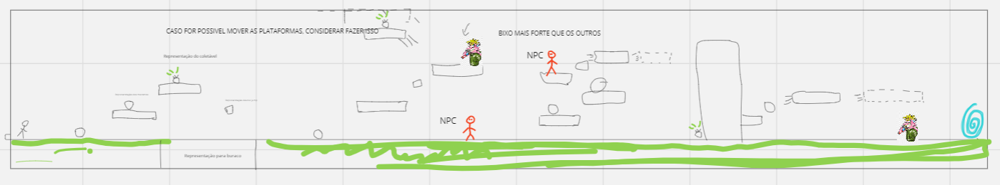
Fonte: Material produzido pelos autores (2024)

Figura 1: Descrição dos objetos dispostos na primeira cena de combate, como plataformas, NPCs e coletáveis.

Figura 2 - Página de preload - Exemplo de modularização do código
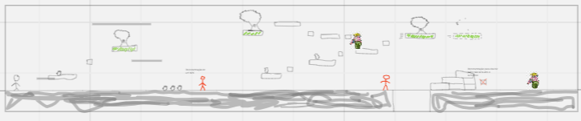
Fonte: Material produzido pelos autores (2024)

Figura 2: Descrição dos objetos dispostos na segunda cena de combate, como plataformas, NPCs e coletáveis.

Figura 3 - Página de preload - Exemplo de modularização do código

Fonte: Material produzido pelos autores (2024)

Figura 3: Descrição dos objetos dispostos na última cena, como as plataformas e as marcas do cenário.

### 3.3.5. Trilha sonora

\# | título | ocorrência | autoria
--- | --- | --- | ---
1 | Pure Imaginaion | tela de início | - <a href="https://www.youtube.com/watch?v=tVzXp5ujQXw">Avery Mavery</a>
2 | Acoustic Folk Music Guitar | Level 1 (Quarto do Personagem) | - <a href="https://pixabay.com/music/acoustic-group-acoustic-folk-music-guitar-141345/">Art Music</a>
3 | The Grand Score | Level 2 (Mundo Lúdico) | - <a href="https://www.chosic.com/download-audio/28030/">Alexander Nakarada</a>
4 | The Grand Score | Level 3 (Cidade Unilever) | - <a href="https://pixabay.com/music/solo-guitar-trip-to-home-relaxing-acoustic-guitar-background-music-7625/">Oleksii Kaplunskyi</a>

Licensas: https://mixkit.co/license/#sfxFree
## 3.4. Inventário e Bestiário

### 3.4.1. Inventário

&nbsp;&nbsp;&nbsp;&nbsp;O inventário é constituído por todos os itens presentes dentro do jogo.

\# | item |  | como obter | função | efeito sonoro
--- | --- | --- | --- | --- | ---
1 | Rexona |  | ele pode ser obtido no início da cena 3 | aumentar a força do personagem | Não tem
2 | Omo | 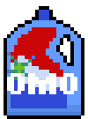 | ele pode ser obtido no final da cena 4 | aumentar a força do personagem | Não tem
3 | Kibon | 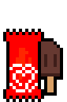 | ele pode ser obtido no final da cena 5 | aumentar a mobilidade do personagem | Não tem

### 3.4.2. Bestiário
&nbsp;&nbsp;&nbsp;&nbsp;O bestiário é constituído por todos os inimigos presentes dentro do jogo.
\# | Inimigo |  | Ocorrências | Função | Impacto | Efeito sonoro
--- | --- | --- | --- | --- | --- | ---
1 | Slime verde | 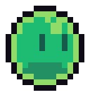 | Primeira cena de combate | Pula no chão em sua direção, com velocidade constante, tendo 2 de vida e 1 de dano por ataque e com o objetivo de atacar o personagem| Caso o jogador encoste no inimigo, o personagem perderá 1 ponto de vida | Som de slime
2 | Slime roxo | 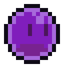 | Primeira cena de combate | Pula no chão em sua direção, com velocidade constante, tendo 3 de vida e 1 de dano por ataque e com o objetivo de atacar o personagem| Caso o jogador encoste no inimigo, o personagem perderá 1 ponto de vida | Som de slime
3 | Smoke | 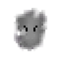 | Segunda cena de combate | Anda na direção do player e possui 2 de vida e 1 de dano| Caso o jogador encoste no projétil do inimigo, o personagem perderá 1 ponto de vida | Não tem
4 | BlackSmoke | 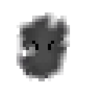 | Segunda cena de combate | Anda na direção do player e possui 3 de vida e 1 de dano| Caso o jogador encoste no projétil do inimigo, o personagem perderá 1 ponto de vida | Não tem
5 | Chefe Desmatamento | 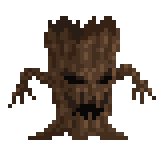 | No final do nível 2 | Anda na direção do player e possui 5 de vida e 2 de dano| Caso o jogador encoste no projétil do inimigo, o personagem perderá 2 ponto de vida | Não tem
6 | Rei da Poluição | 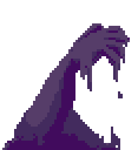 | No final do nível 3 | Anda na direção do player e possui 5 de vida e 2 de dano| Caso o jogador encoste no projétil do inimigo, o personagem perderá 2 ponto de vida | Não tem

## 3.5. Gameflow (Diagrama de cenas)

&nbsp;&nbsp;&nbsp;&nbsp;Essa imagem apresenta um diagrama de fluxo de jogo para "UniWorld". Nele, encontramos várias cenas do jogo, diagramas de classe associados à programação orientada a objetos, e explicações sobre a progressão do jogador e suas interações. Aqui está uma explicação detalhada dos diferentes elementos:

&nbsp;&nbsp;&nbsp;&nbsp;Na cena inicial, quando o jogador inicia o jogo, é recebido com a tela inicial, oferecendo opções para jogar ("PLAY"), ajustar configurações ou silenciar o som. À esquerda, vemos um diagrama de classe intitulado "Tela de Título", que lista atributos e métodos como setInteractive() e preloadGame(), indicando que esta tela prepara o jogo para começar e configura elementos interativos.

&nbsp;&nbsp;&nbsp;&nbsp;Na cena de Seleção de Personagem, o jogador pode escolher seu personagem. O diagrama de classe associado é "Seleção de Jogador", com atributos como countdown e cloudCover, e métodos incluindo startGame() e setInteractive(). Nisso, vemos  a presença de um temporizador de contagem regressiva e uma animação como se fosse nuvens cobrindo os personagens antes da seleção.

&nbsp;&nbsp;&nbsp;&nbsp;No Mundo do Jogo, a área principal de jogabilidade, o jogador navega com o personagem pelo mundo, explorando, eliminando inimigos e superando obstáculos. O diagrama de classe inclui atributos como player e métodos como createPlayer(), createWorldLevel(), e vários outros que indicam funcionalidades para criar o nível, o personagem do jogador e a física do jogo.

&nbsp;&nbsp;&nbsp;&nbsp;Na cena do Quarto, o jogador está dentro de um quarto e deve interagir com um objeto, um item "Renona", para coletá-lo. O diagrama de classe é semelhante ao "Jogador no Mundo", mas inclui um método createMap(), sugerindo que esta cena envolve navegar em um espaço menor e fechado, como um mapa.

&nbsp;&nbsp;&nbsp;&nbsp;Cada cena é conectada por linhas vermelhas para a próxima, indicando o fluxo do jogo. O jogador começa na tela inicial, escolhe seu personagem, entra no mundo do jogo para navegar pelos níveis e interage com objetos em cenas específicas, como o quarto.

&nbsp;&nbsp;&nbsp;&nbsp;Esse tipo de diagrama é útil para os desenvolvedores de jogos planejarem a progressão do jogo, as classes e métodos necessários para implementar diferentes cenas do jogo, e para acompanhar como o jogador irá experimentar o jogo do início ao fim.

Figura 1 - Diagrama de Cenas
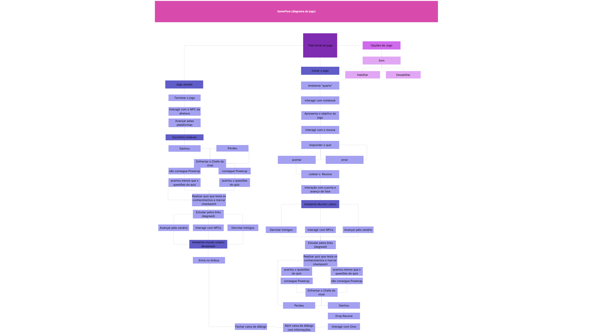
Fonte: Material produzido pelos autores (2024)

## 3.6. Regras do jogo

&nbsp;&nbsp;&nbsp;&nbsp;O jogador deve concluir a fase, ganhando *power-ups* e derrotando os inimigos. Além disso, deve derrotar dois *boss*, o Rei desmatamento e o Rei poluição. Ao derrotar cada rei, o jogador deverá responder um quiz para ganhar o *power-up*. Caso ele acerte, vai receber uma bonificação em alguma habilidade (força, alcance, velocidade...).
## 3.7. Mecânicas do jogo (sprint 3)

&nbsp;&nbsp;&nbsp;&nbsp;No nosso jogo de plataforma 2D para computador, o jogador pode utilizar as teclas de seta do teclado para usar as mecânicas de se locomover e pular. Além disso caso o jogador pressione 2 vezes seguidas as teclas para cima o personagem irá dar um pulo duplo. Outra tecla importante para a jogabilidade proposta no nosso game é a tecla E, que usa a mecânica de interação, caso apertada ao lado de um NPC ou power-up. Por fim, a tecla Q é responsável pela mecânica de ataque do jogador e a tecla W pela mecânica de movimentação de avanço rápido.

# 4. Desenvolvimento do Jogo

## 4.1. Desenvolvimento preliminar do jogo

&nbsp;&nbsp;&nbsp;&nbsp;O processo inicial de desenvolvimento se deu por meio da entrega do MPV, implementando a existência de um cenário e  a movimentação básica do personagem, como ilustra a figura 1. Além disso, diálogos com NPCs (Personagem não Jogável) também foram incluídos, contemplados na figura 2.

Figura 1 - Fase Inicial - Mundo Lúdico
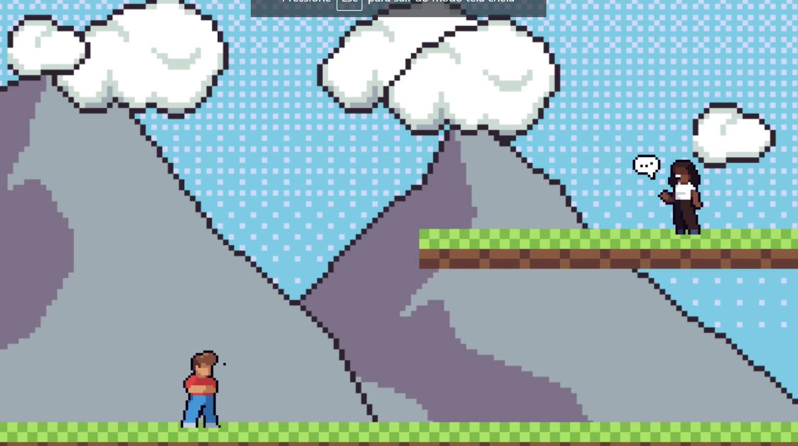
Fonte: Material produzido pelos autores (2024)

Figura 2 - Fase Inicial - Interação com NPC
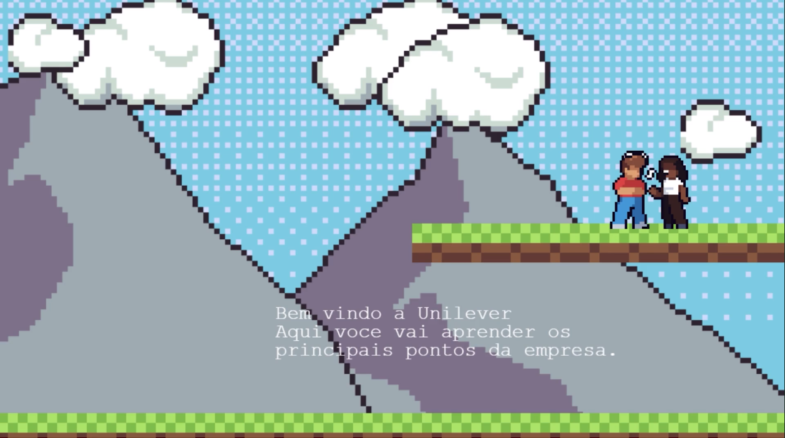
Fonte: Material produzido pelos autores (2024)

&nbsp;&nbsp;&nbsp;&nbsp;As demonstrações acima destacam o processo preliminar de desenvolvimento de jogo.

## 4.2. Desenvolvimento básico do jogo

&nbsp;&nbsp;&nbsp;&nbsp;Ao longo do desenvolvimento da versão básica do jogo, o grupo foi capaz de incluir novas mecânicas, novo design e mais fases. A figura 1 abaixo ilustra a tela de início funcional do jogo, que permite o acesso às demais funcionalidades. Em seguida, a figura 2 apresenta a tela de seleção de personagem criada, possibilitando maior diversidade ao representar o colaborador. A figura 3 ilustra o ambiente do Quarto, que contém as novas interações com itens e NPCs (Personagens Não-Jogáveis), como demonstradas na figura 4. Por fim, a figura 5 ilustra o novo cenário ao ar livre chamado Mundo Lúdico, que será intermediário ao longo do jogo.

Figura 1 - Tela de Início
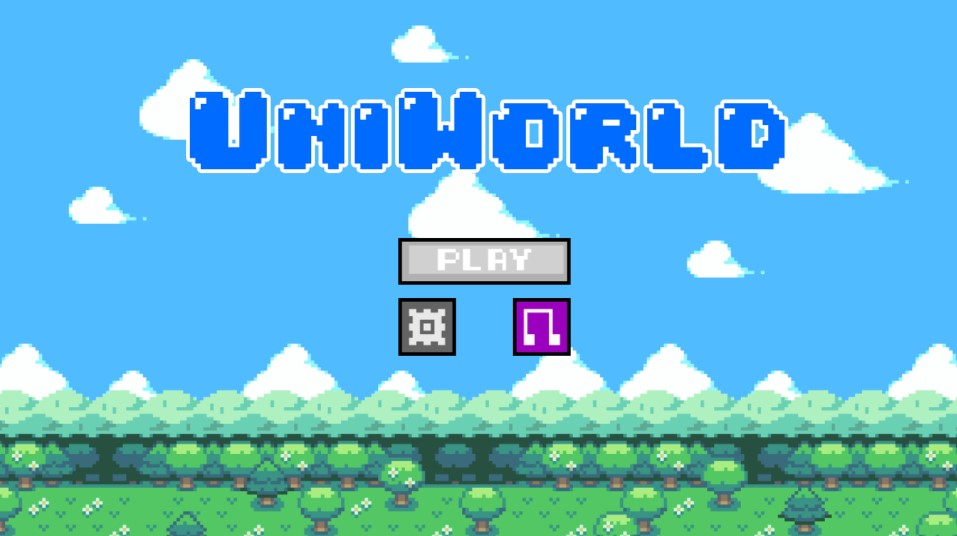
Fonte: Material produzido pelos autores (2024)

Figura 2 - Seleção de Personagem

Fonte: Material produzido pelos autores (2024)

Figura 3 - Fase 1 - Quarto

Fonte: Material produzido pelos autores (2024)

Figura 4 - Fase 1 - Interação com NPC dentro do Quarto
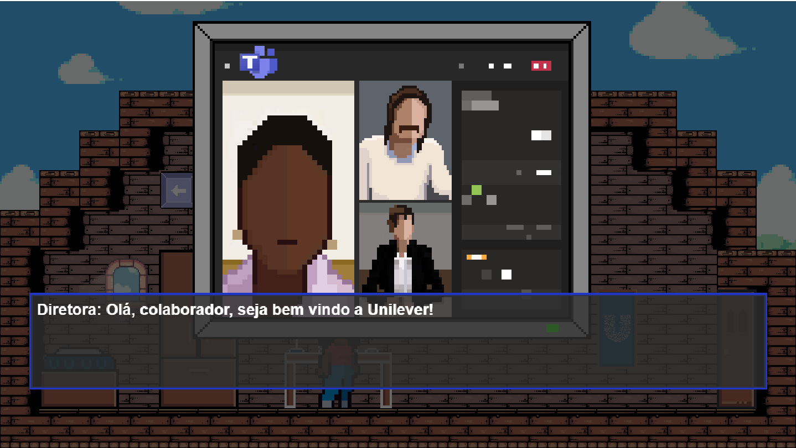
Fonte: Material produzido pelos autores (2024)

Figura 5 - Fase 2 - Mundo Lúdico
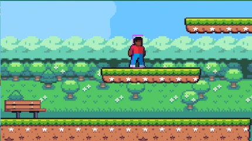
Fonte: Material produzido pelos autores (2024)

&nbsp;&nbsp;&nbsp;&nbsp;Diante das implementações, pode-se apontar grande avanço em relação ao desenvolvimento preliminar, apresentando grandes implementações como um novo nível e melhora no funcionamento dos diálogos com personagens não jogáveis.

## 4.3. Desenvolvimento intermediário do jogo

&nbsp;&nbsp;&nbsp;&nbsp;Optamos por manter o estilo de jogo 2D de plataforma e aventura em pixels, inspirado em jogos clássicos como Super Mario World, Mega Man e Sonic. Essa escolha foi resultado de uma análise das mecânicas de jogabilidade desses títulos e de como elas poderiam ser adaptadas e melhoradas para atender aos objetivos específicos do nosso jogo.

&nbsp;&nbsp;&nbsp;&nbsp;A escolha de manter um ambiente colorido, combinado com desafios ambientais, foi pensada na ideia de oferecer entretenimento e também uma jogabilidade que promova o aprendizado e o engajamento dos funcionários. Aprimorar a narrativa da Unilever, com a missão de recuperar as marcas roubadas pelos vilões, foi uma decisão estratégica para alinhar o jogo com os valores e objetivos da empresa, tornando-o relevante e significativo para o público-alvo.

&nbsp;&nbsp;&nbsp;&nbsp;Os controles simplificados e a jogabilidade intuitiva foram aprimorados após avaliar feedbacks e testes anteriores, visando oferecer uma experiência mais fluida e imersiva para os jogadores. Adicionamos elementos como power-ups, NPCs informativos e recompensas estrategicamente para enriquecer a experiência de jogo.

&nbsp;&nbsp;&nbsp;&nbsp;Visualmente, o estilo pixel art e a trilha sonora foram refinados para criar uma atmosfera envolvente e atraente, garantindo uma imersão total no universo do jogo e fortalecendo a identidade visual e sonora do projeto.

&nbsp;&nbsp;&nbsp;&nbsp;Dessa forma, cada escolha e elemento do jogo para a Unilever foi analisado, melhorado e implementado após um processo de reflexão, resultando em uma experiência de jogo melhor e mais impactante para os jogadores.

Figura 1 - Fase 1 - Interação com NPC dentro do Quarto

Fonte: Material produzido pelos autores (2024)

&nbsp;&nbsp;&nbsp;&nbsp;Para a construção dos mapas do jogo, empregamos duas ferramentas essenciais: o Aseprite e o Tiled. No Aseprite, produzimos sprites de alta qualidade, incluindo personagens, objetos e elementos visuais do cenário. Em paralelo, o Tiled foi usado para montar os mapas de forma estruturada, com cada bloco configurado com o tamanho padrão de 64x64 pixels, proporcionando consistência visual e facilitando a organização dos elementos no ambiente de jogo.

&nbsp;&nbsp;&nbsp;&nbsp;Além disso, buscamos complementar a estética dos mapas com imagens do itch.io, que trouxeram detalhes e elementos visuais adicionais para enriquecer a experiência dos jogadores. Essa combinação de recursos e ferramentas resultou em ambientes gráficos detalhados, coesos e envolventes, garantindo uma jornada visualmente estimulante e imersiva ao explorar os diversos cenários do jogo.

&nbsp;&nbsp;&nbsp;&nbsp;Dentro do âmbito técnico, o jogo já possui grandes avanços. Antes mesmo da programação do jogo em si houve a criação de uma tela de pré-carregamento dedicada, garantindo uma modularidade do código, onde todos os preloads poderiam ser encontrados de uma vez só. Essa tela é essencial para carregar todos os recursos necessários, como imagens, áudios e outros ativos, otimizando assim o desempenho geral do jogo.

Figura 2 - Página de preload - Exemplo de modularização do código
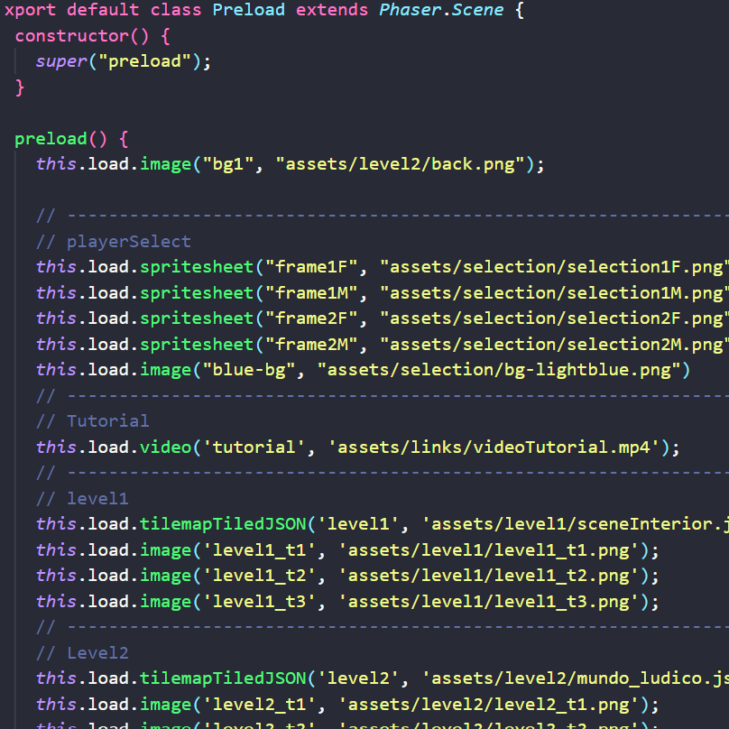
Fonte: Material produzido pelos autores (2024)

&nbsp;&nbsp;&nbsp;&nbsp;Em seguida, iniciamos o processo de confecção do jogo em si. Buscando referências externas, chegamos a conclusão que em jogos desse estilo, é natural trazer uma tela de título antes da jogatina, no intuito de induzir o jogador a querer iniciar o jogo, mas além disso, buscamos já imergir o jogador no estilo de arte pixelada que ele encontrará ao longo da aventura, e mergulhar os jogadores em uma atmosfera nostálgica desde o início.

Figura 3 - Página de título - Apresentação inicial do game
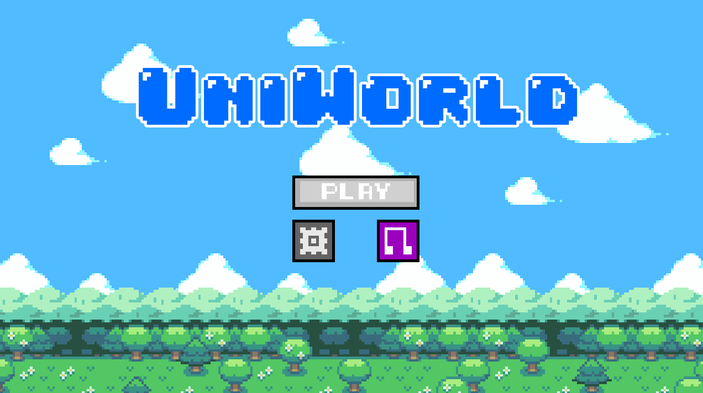
Fonte: Material produzido pelos autores (2024)

&nbsp;&nbsp;&nbsp;&nbsp;Para simplificar o gerenciamento das transições entre as diferentes cenas do jogo, fazemos uso da classe Phaser.Scene. Essa abordagem não só facilita a criação de ambientes de jogo coesos, mas também contribui para uma experiência de jogo mais organizada e envolvente. Ao tornar o botão "PLAY" interativo, com o auxílio dessa classe a transição para a próxima cena se torna eficiente e enxuta.

Figura 4 - Botão de PLAY - Interatividade e Comandos
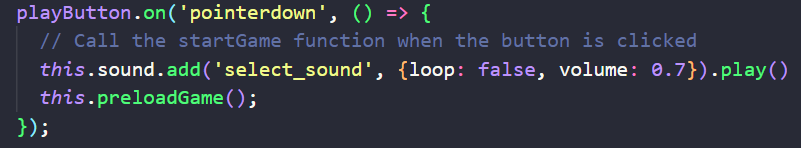
Fonte: Material produzido pelos autores (2024)

Figura 5 - Transição de Cena - Utilização do Phaser.Scene
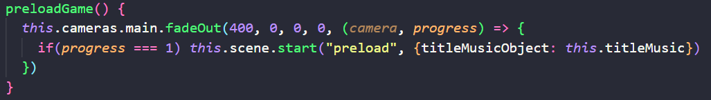
Fonte: Material produzido pelos autores (2024)

&nbsp;&nbsp;&nbsp;&nbsp;Dando um passo adiante na direção da inclusão e diversidade, foi encontrado em uma pesquisa de público alvo uma necessidade latente de englobar a diversidade dentro do jogo. Por conta disso, implementamos um sistema de seleção de personagens complexo. Os jogadores podem escolher entre quatro personagens diferentes, cada um com suas próprias características e aparências únicas.

Figura 6 - Inclusão e Diversidade - Player select
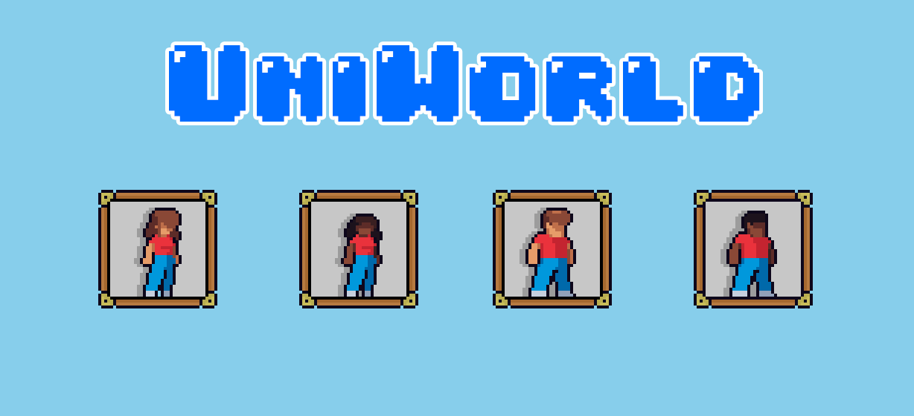
Fonte: Material produzido pelos autores (2024)

&nbsp;&nbsp;&nbsp;&nbsp;Quando o jogador interage com a tela da player select, o código reage de acordo com a seleção feita. Por exemplo, ao clicar em uma das quatro imagens dos personagens disponíveis, um evento de clique é acionado. Esse evento desencadeia uma função que atribui um número de ID ao personagem selecionado. Esse ID pode variar de 1 a 4, representando cada um dos quatro personagens.

&nbsp;&nbsp;&nbsp;&nbsp;A variável 'selectedPlayer' é então atualizada com o ID do personagem escolhido. Essa variável tem um papel crítico no controle das animações e spritesheets associadas ao personagem selecionado. Por exemplo, se o jogador selecionar o personagem com ID 2, a variável 'selectedPlayer' será definida como 2.

&nbsp;&nbsp;&nbsp;&nbsp;Essa informação é utilizada em uma função específica, como a 'initAnimations', que é responsável por carregar as animações corretas para o personagem escolhido. Isso é feito utilizando estruturas de decisão condicionais, como instruções if-else, que verificam o valor da variável 'selectedPlayer' e carregam as spritesheets e animações correspondentes.

Figura 7 - Trecho de código da Player Select - Números de ID
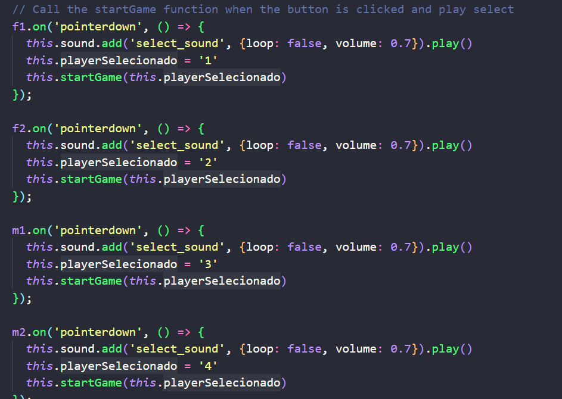
Fonte: Material produzido pelos autores (2024)

Figura 8 - Trecho de código da PlayerAnims - Infusão do ID para carregamento dos sprites desejados
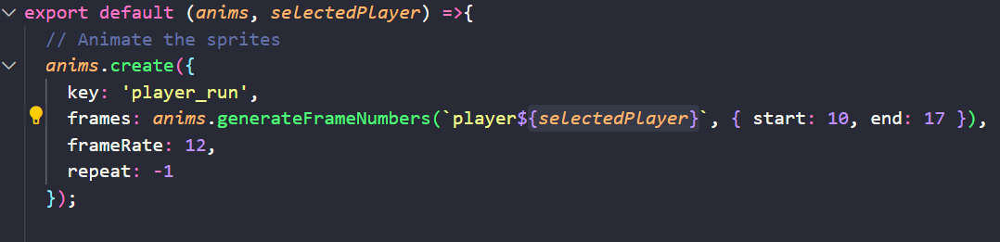
Fonte: Material produzido pelos autores (2024)

&nbsp;&nbsp;&nbsp;&nbsp;Na primeira cena de interação, os jogadores são introduzidos às mecânicas básicas do jogo. Aqui, eles aprendem sobre as habilidades de movimentação do personagem principal, incluindo movimento horizontal e vertical.

Figura 9 - Imagem do tutorial - Primeira cena de interação com o usuário
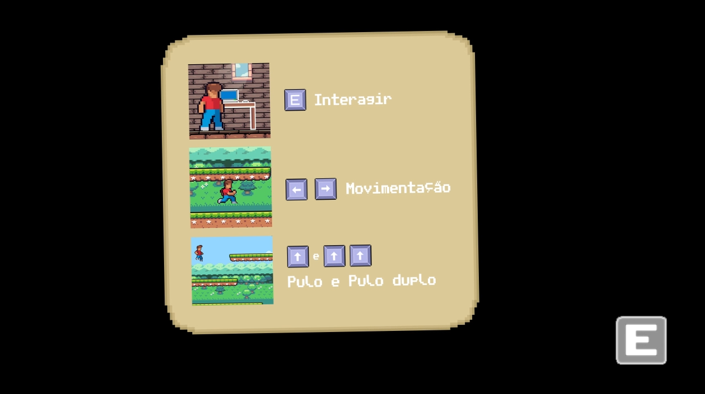
Fonte: Material produzido pelos autores (2024)

&nbsp;&nbsp;&nbsp;&nbsp;Para isso ser possível, foi feito um vídeo em formato de cutscene. Com o método do Phaser "create", o vídeo é adicionado na tela, fazendo com que pareça que uma imagem está se locomovendo.

Figura 10 - Trecho do código da TutorialScreen - criando a animação do vídeo/sub>
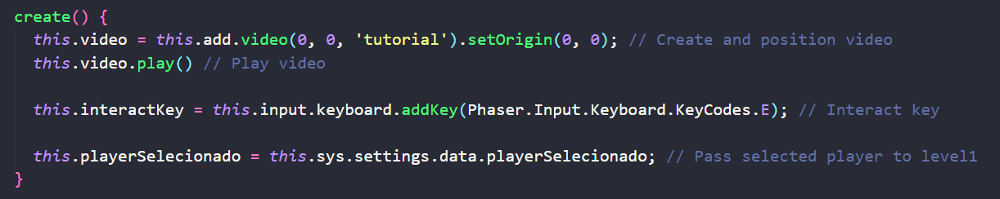
Fonte: Material produzido pelos autores (2024)

Ao adentrar a cena do quarto em nosso jogo, proporcionamos uma transição visual e narrativa fluida do tutorial anterior. Iniciamos com a tela escurecida da cena anterior gradualmente clareando, criando uma sensação de continuidade e imersão para o jogador. Assim que o ambiente se torna visível, o jogador se encontra diante de um computador. Esse elemento é destacado visualmente, com um brilho sutil ao redor, indicando sua interatividade. Uma prompt visual instrui o jogador a pressionar a tecla "E" para interagir.

Ao realizar essa interação, uma caixa de texto surge, introduzindo a história do jogo e delineando o objetivo principal do jogador: auxiliar na recuperação das marcas roubadas da Unilever. Essa abordagem não só envolve o jogador na narrativa, mas também fornece contexto para suas futuras ações no jogo.

Figura 11 - Imagem do Teams - player recebendo a missão 
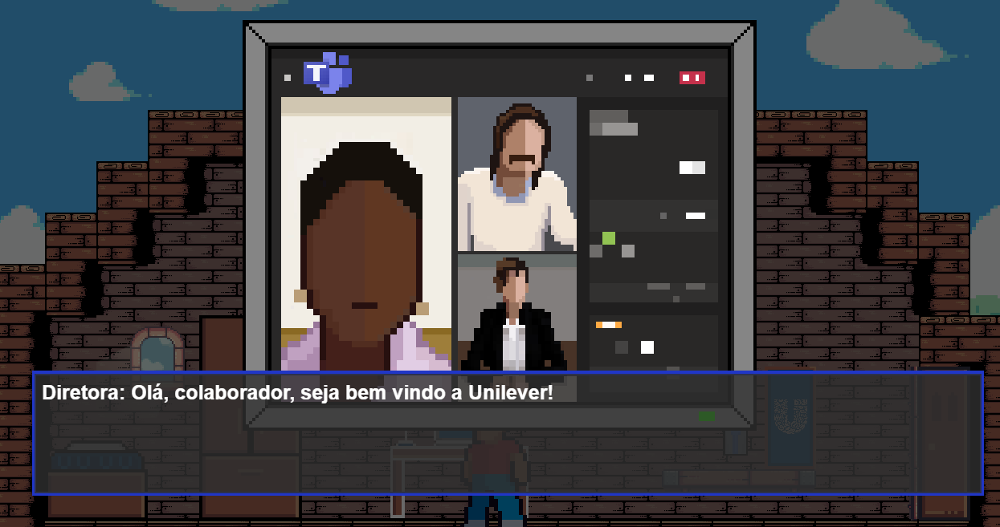
Fonte: Material produzido pelos autores (2024)

Após a interação inicial com o computador, o jogador percebe outro item colecionável na sala: um desodorante da marca Rexona. Novamente, um feedback visual e a instrução para pressionar "E" indicam a possibilidade de interação. Ao fazê-lo, o jogador é apresentado a um quiz que não apenas aprimora o envolvimento narrativo, mas também serve como um mecanismo para avaliar o conhecimento do jogador sobre informações relevantes à Unilever. Caso o jogador erre alguma pergunta, é oferecida a oportunidade de refazer o quiz para consolidar o aprendizado.

Ao coletar o item com sucesso, um feedback auditivo sutil confirma a ação do jogador, fornecendo uma resposta imediata e recompensadora. Além disso, a presença de uma trilha sonora de fundo, cuidadosamente selecionada para evocar conforto e familiaridade, contribui para estabelecer uma atmosfera acolhedora e imersiva na cena do quarto.

Cada elemento nessa etapa foi projetado com o objetivo de envolver o jogador na narrativa, oferecer feedback claro e criar uma experiência de jogo coesa e agradável. Ao integrar sons e interações visuais significativas, buscamos garantir que o jogador se sinta imerso no universo do jogo e motivado a prosseguir em sua jornada de aprendizado e exploração.

&nbsp;&nbsp;&nbsp;&nbsp;Em seguida à cena do menu e do quarto, o jogador embarca na aventura no "Mundo Lúdico", o primeiro mapa do jogo. Neste cenário encantador, concebemos uma experiência imersiva que desafia o jogador a superar obstáculos e derrotar inimigos enquanto explora um ambiente vibrante e cheio de vida.

Figura 12 - Inclusão e Diversidade - Player select

Fonte: Material produzido pelos autores (2024)

&nbsp;&nbsp;&nbsp;&nbsp;Uma das mecânicas mais importantes do jogo é a movimentação e o pulo duplo. A movimentação é controlada pelas teclas direcionais do teclado ou pelas teclas A, W e D. Já o pulo duplo adiciona uma camada adicional de complexidade à jogabilidade, permitindo que os jogadores realizem até dois pulos consecutivos. Uma imagem que demonstre a movimentação do personagem e a mecânica do pulo duplo seria ideal para elucidar este ponto.

&nbsp;&nbsp;&nbsp;&nbsp;O objetivo ao criar o Mapa 1 foi introduzir os jogadores ao universo do jogo de forma cativante e envolvente. Para alcançar esse objetivo, optamos por um ambiente lúdico e inspirador, onde o jogador se sentiria motivado a explorar e progredir. A música de aventura selecionada foi cuidadosamente escolhida para instigar entusiasmo e um senso de desafio no jogador, complementando a atmosfera de exploração.

&nbsp;&nbsp;&nbsp;&nbsp;Decidimos incluir diversas decorações temáticas, como placas com o símbolo da Unilever, um avião e um balão com o logo de uma das empresas da Unilever: Dove. Esses elementos não apenas reforçam a identidade da marca, mas também criam uma conexão entre o jogo e o contexto do processo de onboarding dos novos funcionários de TI na Unilever: se conectar com a empresa, seus valores e marcas.

Figura 13 - Trecho código - level 2 
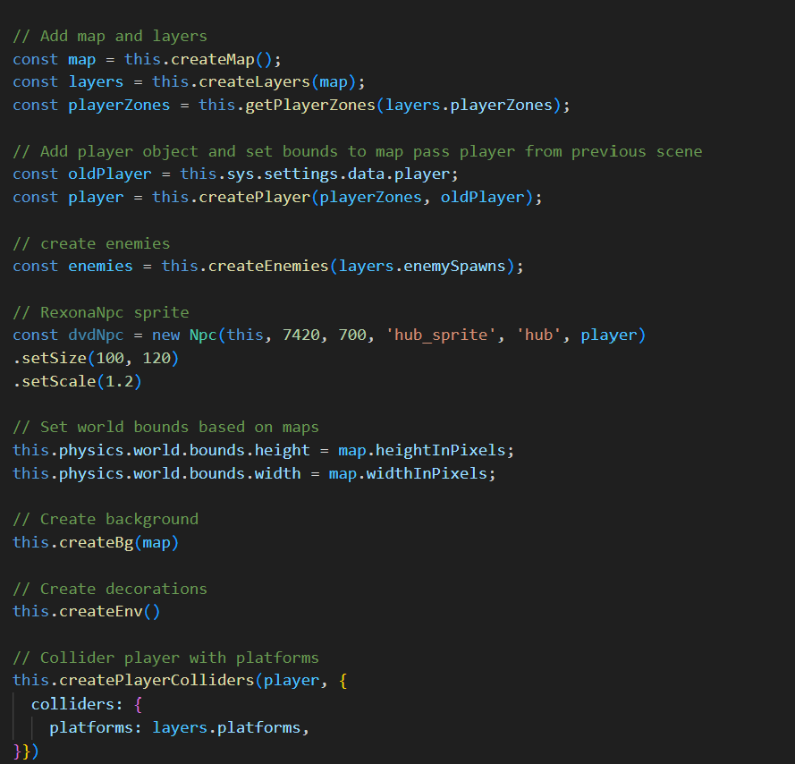
Fonte: Material produzido pelos autores (2024)

&nbsp;&nbsp;&nbsp;&nbsp;A presença da casinha de decoração, que representa o quarto de onde o jogador sai, adiciona um toque de continuidade entre as cenas anteriores e o nível atual. Os inimigos deste nível, como os slimes, foram escolhidos para fazer alusão à lama e ao piche, complementando o tema da floresta utilizado no “Mundo Lúdico” do nosso jogo.

&nbsp;&nbsp;&nbsp;&nbsp;Por fim, o chefe deste mapa, a "Árvore do Mal", simboliza os desafios enfrentados pela empresa em relação à preservação ambiental. Derrotar este chefe requer habilidade e estratégia, proporcionando uma experiência desafiadora e gratificante para o jogador.

&nbsp;&nbsp;&nbsp;&nbsp;No segundo mapa do jogo, transportamos o jogador da atmosfera lúdica do Mundo Lúdico para a Cidade Unilever. Neste cenário urbano, o jogador é confrontado outra questão do mundo real, a poluição.

&nbsp;&nbsp;&nbsp;&nbsp;O objetivo ao criar o Mapa 2 foi oferecer uma continuidade narrativa à história do jogo, enquanto exploramos temas relevantes para a Unilever. Optamos por incluir prédios temáticos com marcas da Unilever, como uma forma de inserir elementos do cotidiano dos funcionários da empresa no contexto do jogo. Além de funcionar como uma forma de conectar os usuários à empresa.

&nbsp;&nbsp;&nbsp;&nbsp;Assim como no primeiro mapa, este também apresenta plataformas, inimigos e um chefe final desafiador. O chefe deste mapa, a representação de uma "Mão de Poluição", representa os desafios ambientais e a responsabilidade corporativa da Unilever em lidar com questões de sustentabilidade e poluição.

&nbsp;&nbsp;&nbsp;&nbsp;Adicionalmente, incluímos um inimigo fácil, a "Fumaça", que persegue o jogador durante a fase, conectando-se ao enredo e reforçando a temática da poluição e impacto ambiental.

&nbsp;&nbsp;&nbsp;&nbsp;Com as bases do jogo estabelecidas neste estágio intermediário de desenvolvimento, estamos prontos para avançar para etapas mais avançadas, incluindo a expansão das mecânicas, a introdução de desafios adicionais e o refinamento geral da experiência do jogador.

Figura 14 - Inimigo - Fumaça 
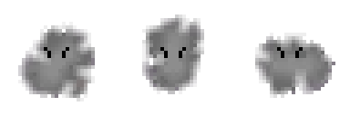
Fonte: Material produzido pelos autores (2024)

&nbsp;&nbsp;&nbsp;&nbsp;O processo criativo para o desenvolvimento do jogo, foi um jornada de refinamento e aprimoramento constante. Analisamos as ideias e elementos anteriores, realizamos melhorias significativas para garantir a melhor experiência possível para os jogadores, construindo um mundo mais amplo e desafiador.

## 4.4. Desenvolvimento final do MVP

Figura 1 - Ilustração da Title Screen
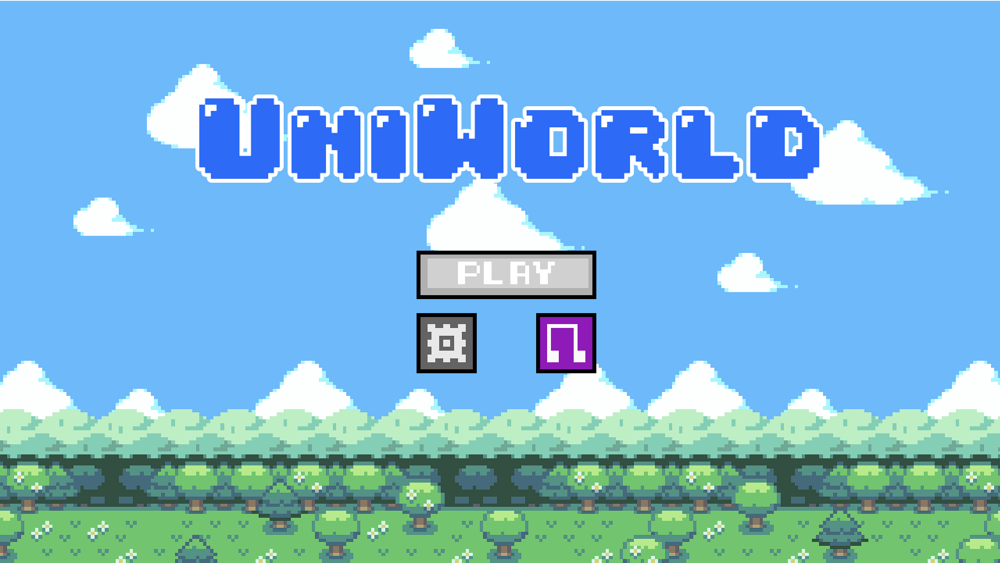
Fonte: Material produzido pelos autores (2024)

&nbsp;&nbsp;&nbsp;&nbsp;Desenvolvemos nosso MVP com uma tela de título, onde é possível realizar algumas configurações do jogo.

Figura 2 - Ilustração da seleção de personagem
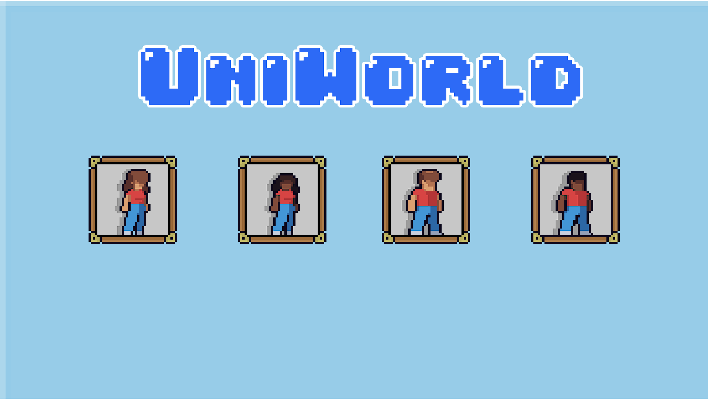
Fonte: Material produzido pelos autores (2024)

&nbsp;&nbsp;&nbsp;&nbsp;Introduzimos um recurso de acessibilidade que permite escolher qual será o seu jogador, aumentando a imersão e proporcionando maior identificação do jogador com o jogo.

Figura 3 - Ilustração do Tutorial
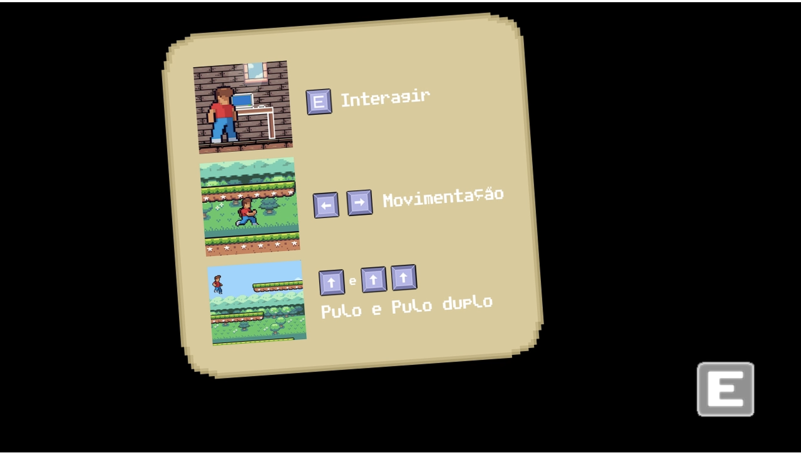
Fonte: Material produzido pelos autores (2024)

&nbsp;&nbsp;&nbsp;&nbsp;Após escolher o personagem, apresentamos uma tela animada com os controles básicos do jogo.

Figura 4 - Ilustração do ambiente Quarto
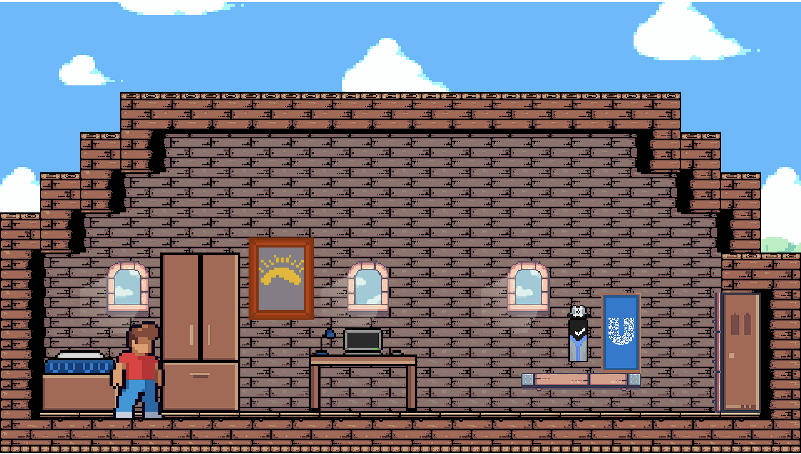
Fonte: Material produzido pelos autores (2024)

&nbsp;&nbsp;&nbsp;&nbsp;O jogo se inicia na casa do colaborador.

Figura 5 - Ilustração do affordance
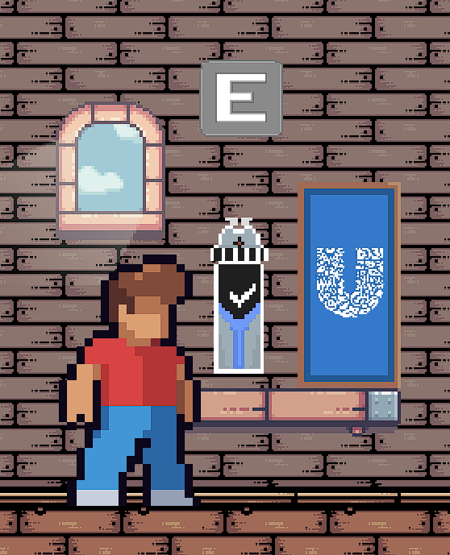
Fonte: Material produzido pelos autores (2024)

&nbsp;&nbsp;&nbsp;&nbsp;Incluímos como affordance a resposta visual do jogador ao interagir com elementos com os quais é possível interagir.

Figura 6 - Ilustração da interação com o computador
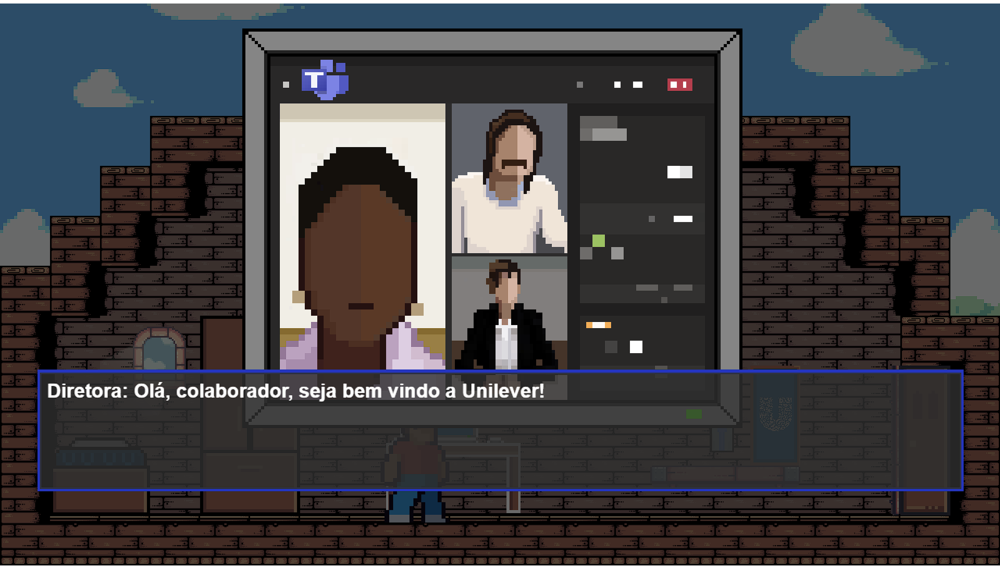
Fonte: Material produzido pelos autores (2024)

&nbsp;&nbsp;&nbsp;&nbsp;No início do jogo, o jogador deve interagir com o computador para receber a missão da diretora da Unilever, recebendo assim uma contextualização do enredo e dos objetivos do jogo.

Figura 7 - Ilustração do Chefão - Level 2
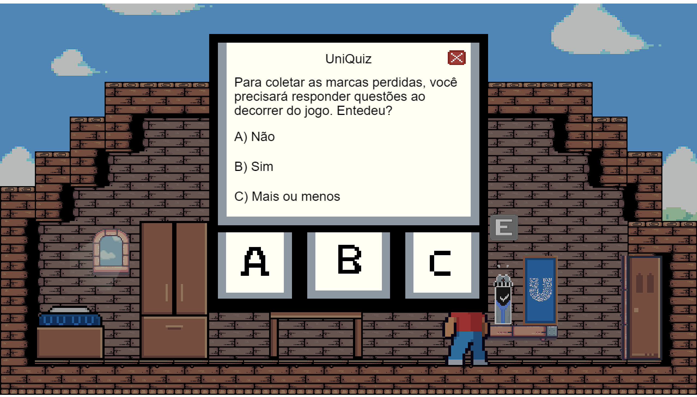
Fonte: Material produzido pelos autores (2024)

&nbsp;&nbsp;&nbsp;&nbsp;Durante o jogo, ao derrotar chefões, surgem power-ups representando produtos da marca Unilever, e para coletá-los, o jogador deve acertar o quiz que aparece após a interação com o item.

Figura 8 - Ilustração do Tutorial
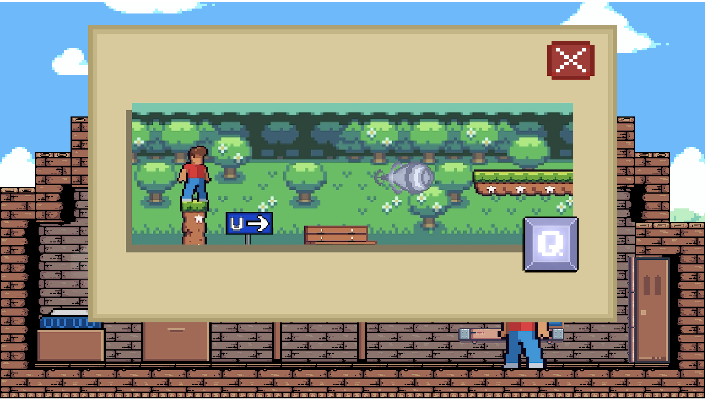
Fonte: Material produzido pelos autores (2024)

&nbsp;&nbsp;&nbsp;&nbsp;Após acertar todas as perguntas do quiz, o jogador desbloqueia melhorias ou novas habilidades. Quando uma nova tecla é adicionada ao conjunto de controles, um pop-up com uma nova tela de tutorial animado explica brevemente a nova mecânica do jogo.

Figura 9 - Ilustração do Level 2
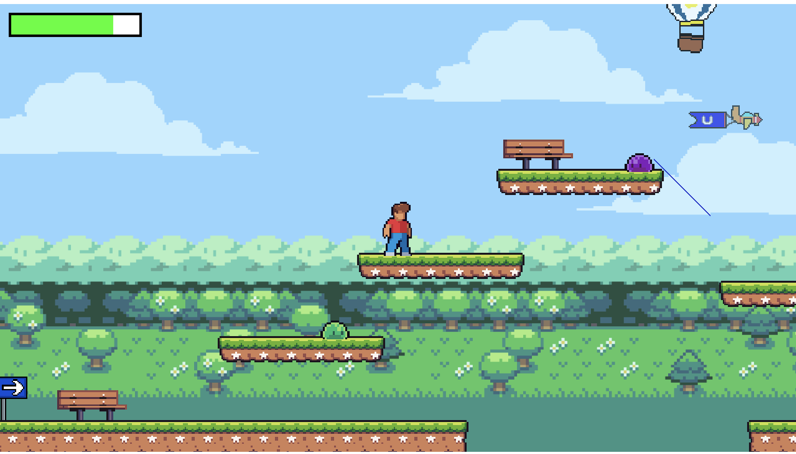
Fonte: Material produzido pelos autores (2024)

&nbsp;&nbsp;&nbsp;&nbsp;Após interagir com todos os elementos disponíveis na primeira fase, o jogador pode sair de casa e começar sua jornada. Então, inicia-se a próxima fase do jogo, que representa um mundo lúdico com vários elementos temáticos da Unilever e inimigos para enfrentar.

Figura 10 - Ilustração do NPC de hub de links / checkpoint
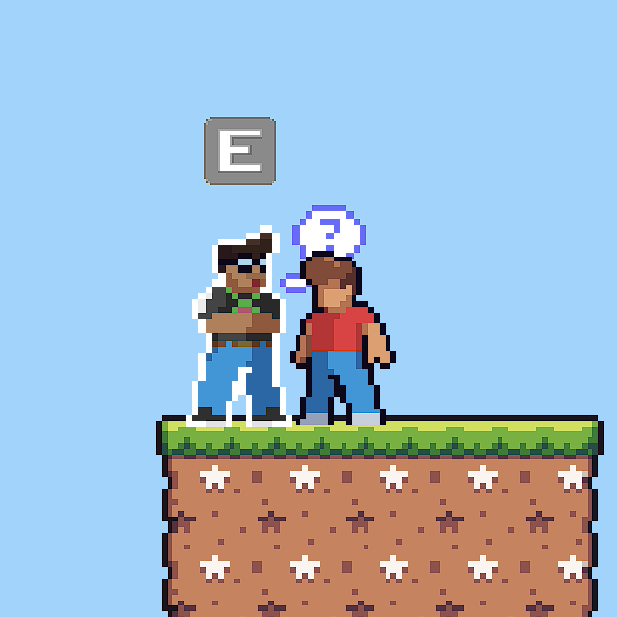
Fonte: Material produzido pelos autores (2024)

&nbsp;&nbsp;&nbsp;&nbsp;Ao longo das fases, um NPC distribui links relacionados ao conteúdo de onboarding necessário para o próximo quiz e também serve como checkpoint.

Figura 11 - Ilustração do hub de links
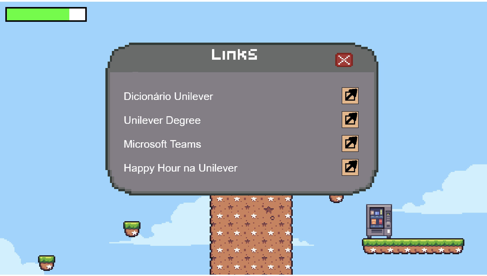
Fonte: Material produzido pelos autores (2024)

&nbsp;&nbsp;&nbsp;&nbsp;Hub de links.

Figura 12 - Ilustração do Tutorial
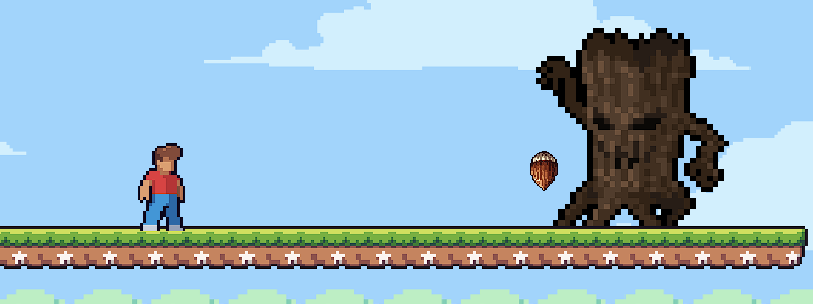
Fonte: Material produzido pelos autores (2024)

&nbsp;&nbsp;&nbsp;&nbsp;No final de cada fase, o jogador deve enfrentar um chefão que, ao ser derrotado, libera uma recompensa (power-up/quiz).

Figura 13 - Ilustração do Power-up
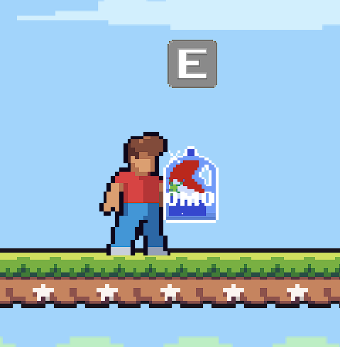
Fonte: Material produzido pelos autores (2024)

Item liberado pelo boss após ser derrotado.

Figura 14 - Ilustração do Level 3
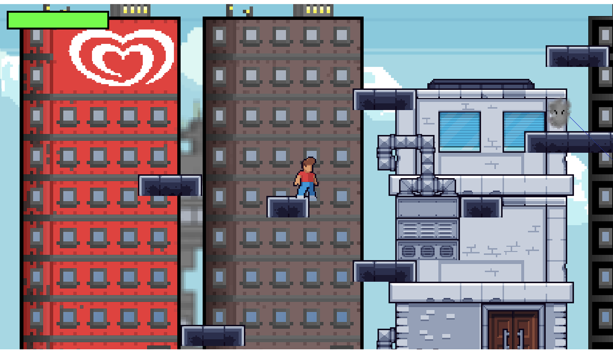
Fonte: Material produzido pelos autores (2024)

&nbsp;&nbsp;&nbsp;&nbsp;Na fase da cidade Unilever, o jogador enfrenta novos inimigos e um novo chefão.

Figura 15 - Ilustração do Chefão - Level 3
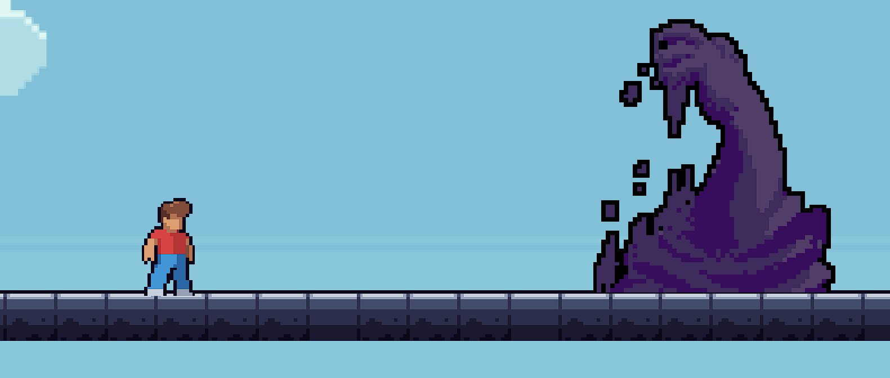
Fonte: Material produzido pelos autores (2024)

&nbsp;&nbsp;&nbsp;&nbsp;Novo chefão da cidade Unilever.

Figura 16 - Ilustração do Tutorial
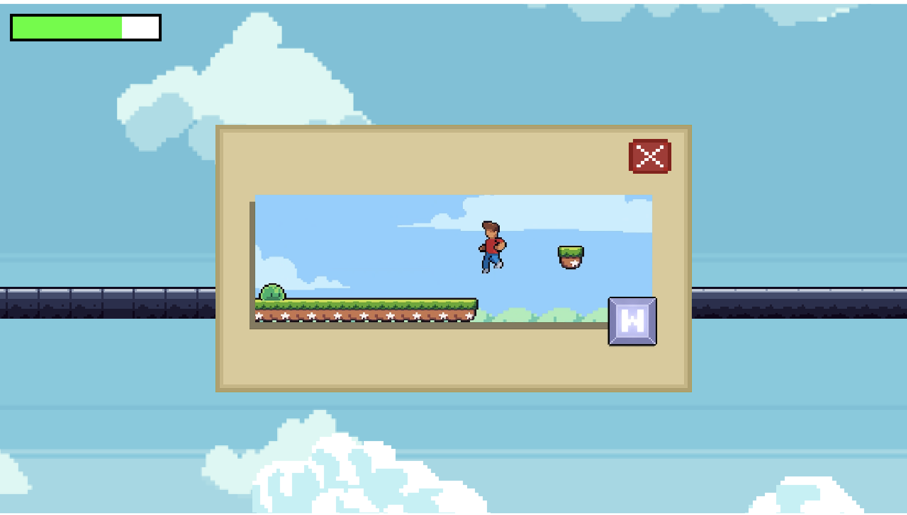
Fonte: Material produzido pelos autores (2024)

&nbsp;&nbsp;&nbsp;&nbsp;Após coletar o power-up do novo chefão, o jogador desbloqueia uma nova habilidade, o "movimento rápido".

Figura 17 - Ilustração do Level 4
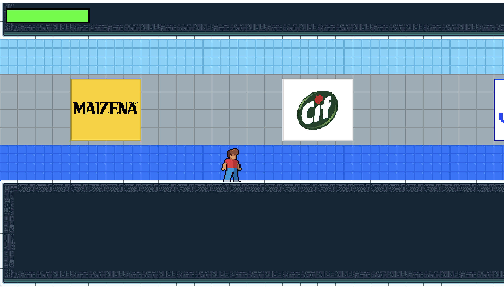
Fonte: Material produzido pelos autores (2024)

&nbsp;&nbsp;&nbsp;&nbsp;Por fim, na fase final, o jogador chega ao escritório da Unilever e conclui o jogo.

&nbsp;&nbsp;&nbsp;&nbsp;Durante o desenvolvimento do MPV, o grupo contemplou todos os elementos necessários para entregar o mínimo produto viável alinhado com os pedidos do parceiro. Assim, foram concluídas as mecânicas de combate, exploração, movimentação e tutoriais, garantindo plenitude no funcionamento do jogo.

## 4.5. Revisão do MVP

### 4.5.1. Novas funcionalidades:

&nbsp;&nbsp;&nbsp;&nbsp;Começamos a sprint de refinamento implementando um sistema de tradução, atualmente temos as traduções em inglês e português.

Figura 18 - Tela de título - Inglês 
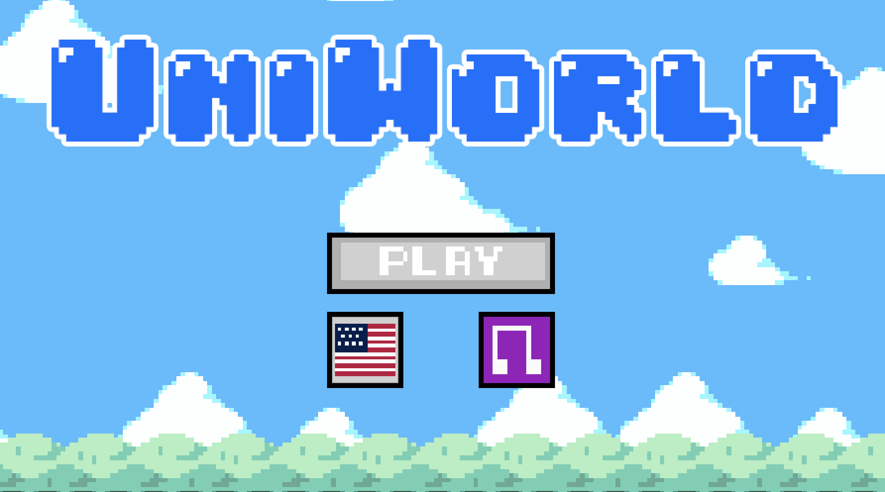
Fonte: Material produzido pelos autores (2024)

Figura 19 - Tela de título - Português 
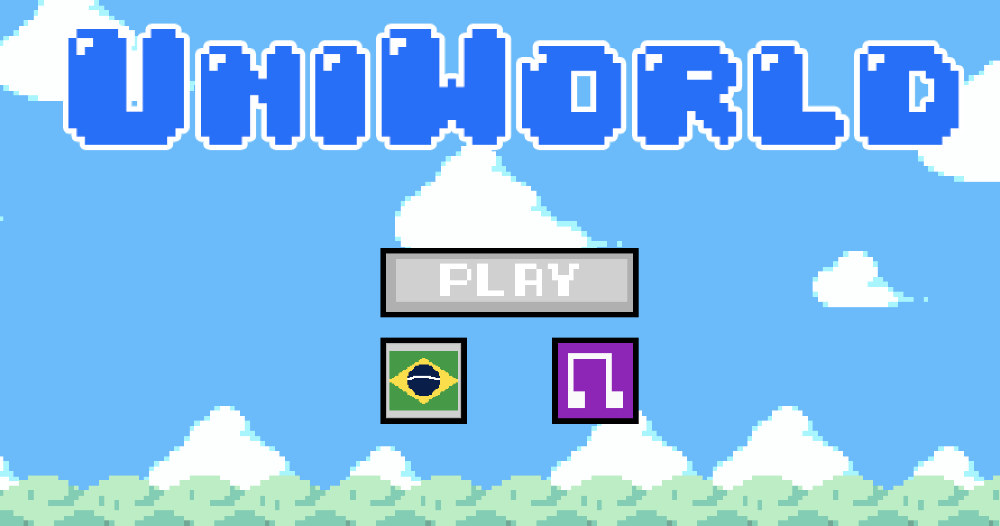
Fonte: Material produzido pelos autores (2024)

&nbsp;&nbsp;&nbsp;&nbsp; E desenvolvemos os arquivos de dialogo e quiz traduzidos:

Figura 20 - Arquivos de texto 
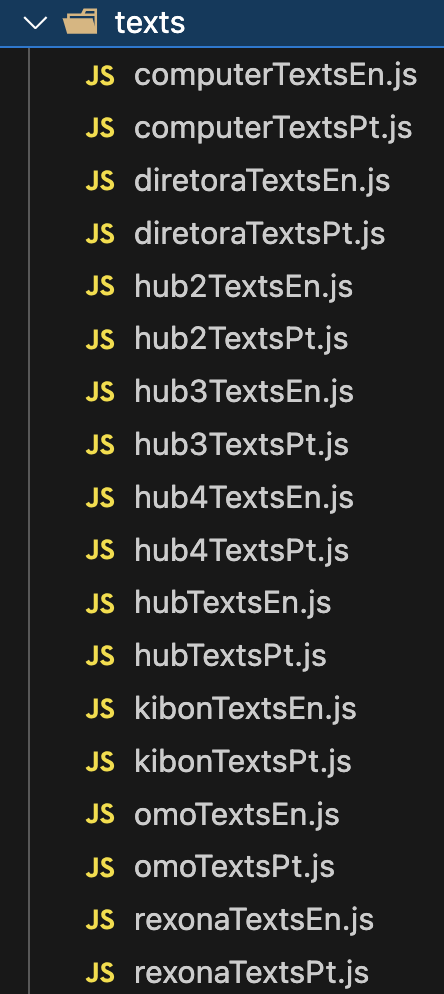
Fonte: Material produzido pelos autores (2024)

&nbsp;&nbsp;&nbsp;&nbsp; Aqui a variável 'this.language' guarda um texto que pode ser "En" ou "Pt" baseado na escolha feita na tela de título

Figura 21 - Importação modular dos textos traduzidos 
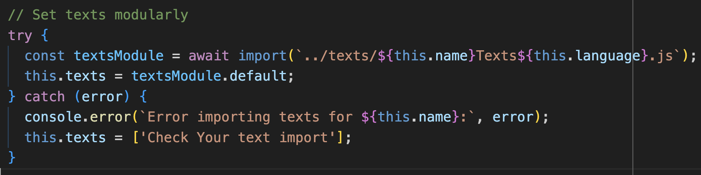
Fonte: Material produzido pelos autores (2024)

&nbsp;&nbsp;&nbsp;&nbsp; Sprite de Super: Nessa Sprint colocamos em jogo os designs de personagens Super. Atualmente contamos com 16 Sprites sendo eles 4 padrões e 4 Super Sprites para cada um deles:

Figura 22 - Todas as possíveis texturas do Player 
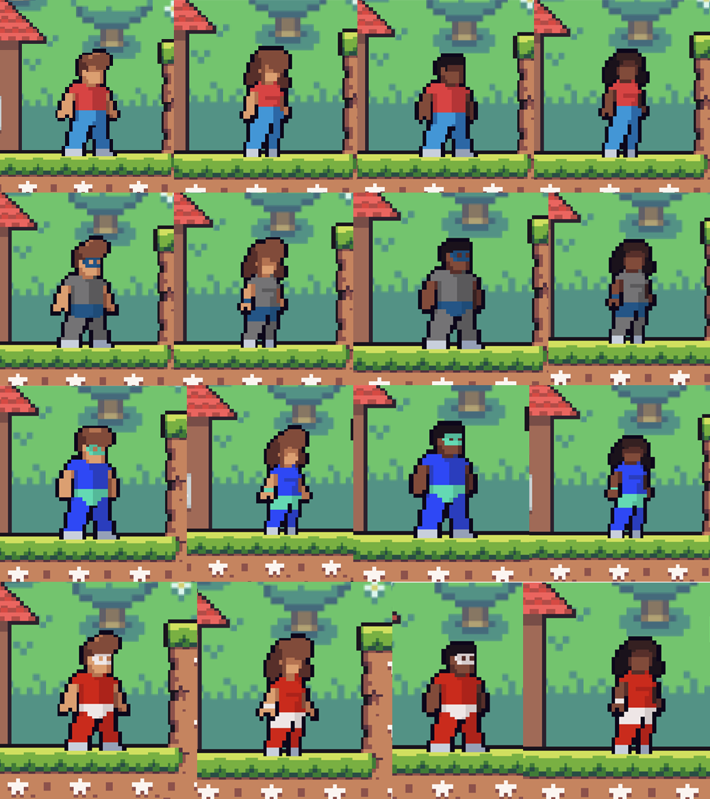
Fonte: Material produzido pelos autores (2024)

&nbsp;&nbsp;&nbsp;&nbsp; Foi implementado através da padronização do nome dos arquivos e criação dinâmica das animações. Toda vez que o player coleta um powerUp, muda a variável 'selectedSprite' para o Sprite correspondente, então deleta as animações antigas e cria as novas como mostrado abaixo:

Figura 23 - Criação das animações 
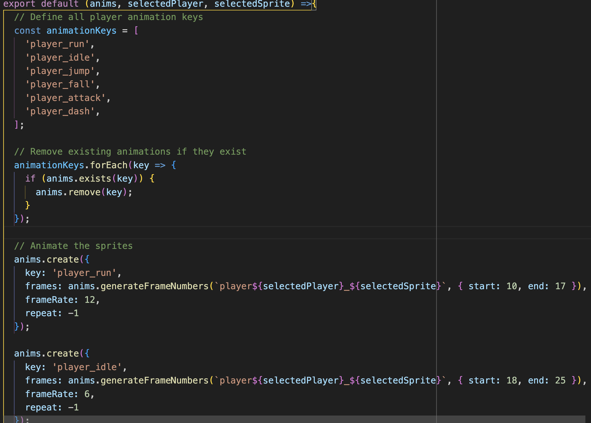
Fonte: Material produzido pelos autores (2024)

&nbsp;&nbsp;&nbsp;&nbsp; O Hub de Links (recurso para aprendizado dos novos colaboradores) foi repensado, melhoramos seu design, adicionamos uma caixa de diálogo e tambem o Checkpoint como sendo a "recompensa" se ambos os links forem abertos. Possuí resposta visual e sonora.

Figura 24 - Hub de Links - 0 Clicks 
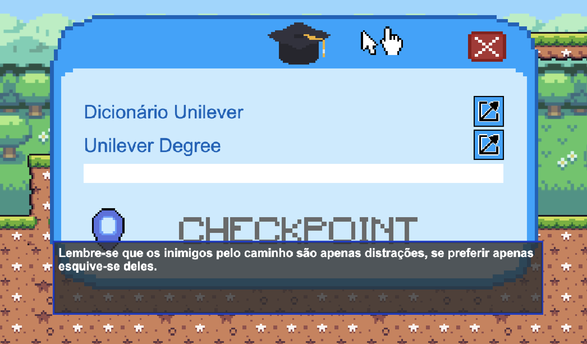
Fonte: Material produzido pelos autores (2024)

&nbsp;&nbsp;&nbsp;&nbsp; Quando o diálogo é finalizado, é abilitado os clicks nos links, a cada click a barra de progresso sobe, quando vc clica em todos os links a barra completa e o Checkpoint é redefinido para aquela localização.

Figura 25 - Hub de Links - 2 Clicks 
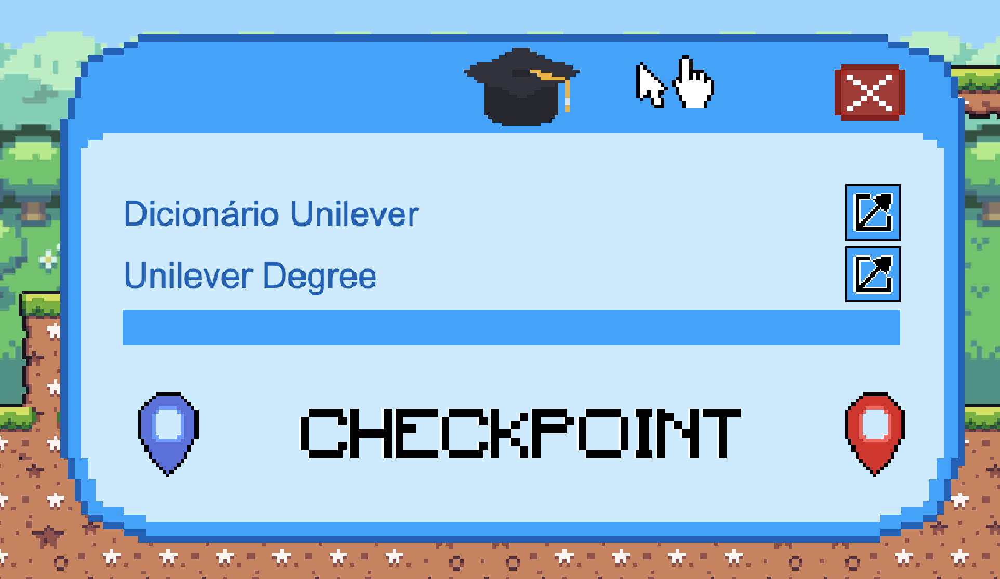
Fonte: Material produzido pelos autores (2024)

&nbsp;&nbsp;&nbsp;&nbsp; Aqui temos um pedaço do código que cria o Hub de links, nesse trecho abrimos uma janela quando o botão é clicado e checamos se ambos os botões ja foram clicados, se sim, define o Checkpoint muda a imagem e toca um som.

Figura 26 - Hub de Links - Código de um botão do link. 
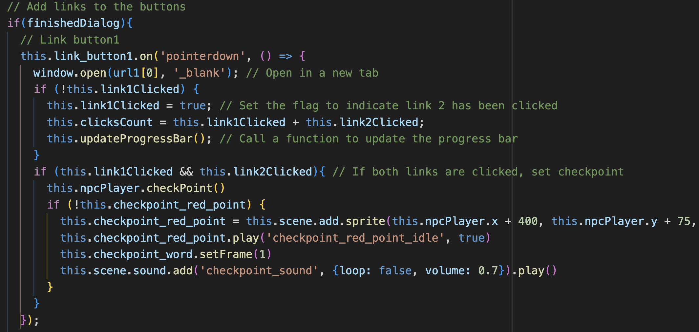
Fonte: Material produzido pelos autores (2024)

### 4.5.2 Resolução de Bugs:

&nbsp;&nbsp;&nbsp;&nbsp; Tinhamos uma inconstância nos projeteis do player, onde em algumas ocasiões o projetil era destruído antes de colidir com um Inimigo, isso acontecia pois não zeravamos a variavel 'this.traveledDistance' quando destruia um projetil, portanto o seguinte ja vinha com um valor elevado nessa variável.

Figura 27 - Destruição de Projetil 
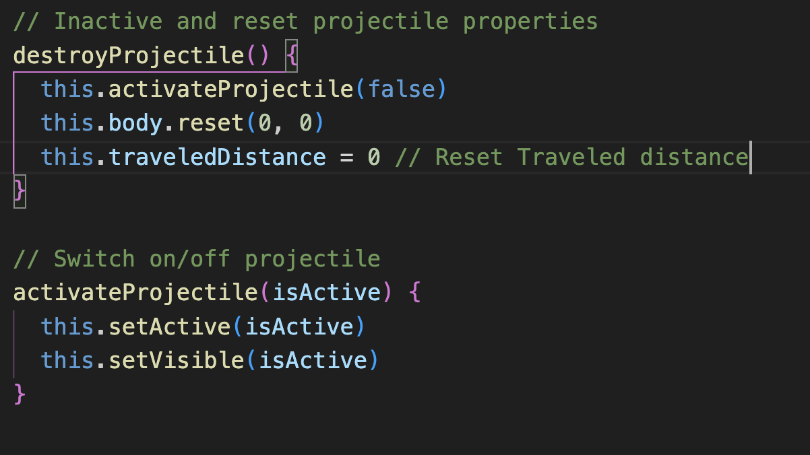
Fonte: Material produzido pelos autores (2024)

&nbsp;&nbsp;&nbsp;&nbsp; Tambem relacionado àos projeteis, o projetil dos chefões não estavam sendo destruidos após acertar o Player, o que causava um comportamento indesejado de Hit Multiplo. Isso foi facilmente resolvido com a criação de uma função destroyProjectile(destroi o projetil) essa que é chamada dentro da função takesHit(lida com a logica de receber dano) do Player

Figura 28 - Lógica de levar Hit 
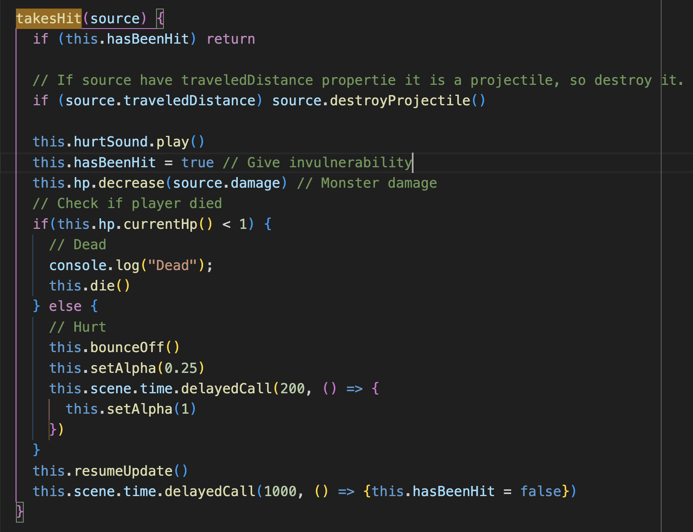
Fonte: Material produzido pelos autores (2024)

# 5. Testes

## 5.1. Casos de Teste

&nbsp;&nbsp;&nbsp;&nbsp;Os casos de testes são fundamentais para validar a procedência do jogo, garantindo que o mesmo funcione corretamente e evitando que os jogadores encontrem bugs e erros durante a experiência de jogo. Em outras palavras, realizamos testes com o objetivo de confirmar a funcionalidade do jogo.

&nbsp;&nbsp;&nbsp;&nbsp;Nesse sentido, conduzimos esses testes com a participação de jovens, incluindo nós mesmos, com idades entre 18 e 20 anos. As avaliações foram realizadas no período de fevereiro a março de 2024. A seguir, apresentamos os resultados desses testes

\# | pré-condição do teste | o que ocorre no teste | resultado esperado do teste
--- | --- | --- | ---
1 | Abrir tela inicial do jogo | Clicar no botão “play” | Iniciar cena 1
2 | Abrir tela inicial do jogo | Clicar no botão “som” | Silenciar som do jogo
3 | Posicionar personagem em frente ao notebook | Apertar tecla de interação com o notebook | Abrir diálogo na plataforma teams
4 | Posicionar o personagem em frente ao Rexona | Apertar tecla de interação com o Rexona | Pegar o item Rexona
5 | Posicionar o personagem em frente à porta do quarto | Passar pela porta do quarto | Encerrar cena e Iniciar cena 2
6 | Entrar no jogo | Apertar “E” na frente do NPC | Interagir com o  NPC
7 | Entrar no jogo | Apertar várias vezes o botão “E” na frente do npc   | O jogo não bugar
8 | Entrar no jogo | Apertar ‘E” com coletáveis   | Coletar o item
9 | Entrar no jogo | Alguém, que nunca jogou o jogo, vai passar todo o jogo | Conseguir finalizar
10 | Entrar no jogo | Alguém, que nunca jogou o jogo, enfrentar os inimigos fáceis | Conseguir finalizar
11 | Entrar no jogo | Alguém, que nunca jogou, enfrentar o boss | Conseguir matá-lo
12 | Entrar no jogo | Pular,correr,ficar parado | Movimentação fluida das sprites
13 | Entrar no menu  | Ativar e desativar o  som | O som parar (ao clicar em desativar) e voltar (ao clicar em ativar)
14 | Entrar na seleção de personagem |  Selecionar personagem | O jogo iniciar com o personagem selecionado

## 5.2. Testes de jogabilidade (playtests)

### 5.2.1 Registros de testes

TESTE 1:

Nome | Bruna Collado
--- | ---
teste conduzido por: | Igor, Rafael, Thiago, David.
idade: | 40
local: | meet/inteli
dia: | 27/03/2024
horário: | 15:00:00.
duração: | 20 minutos.
dispositivo: | computador/notebook
Já possuía experiência prévia com games? | quase nenhuma
Conseguiu iniciar o jogo? | Sim, mas com dificuldades.
Entendeu as regras e mecânicas do jogo? | Não, ela não conseguiu entender as regras e mecânicas do jogo.
Conseguiu progredir no jogo? | Não, ela não entendeu como progredir.
Apresentou dificuldades? | Sim, dificuldade em entender as regras e mecânicas.
Que nota deu ao jogo? | 9.0
O que gostou no jogo? | Estética e teclas intuitivas.
O que poderia melhorar no jogo? | Expliciar as instruções.

Observações:

Ele disse que a velocidade dos projéteis do chefe está muito rápida. Além disso, mencionou que o alcance está inconsistente, às vezes próximo demais, outras vezes distante demais

TESTE 2:

Nome | Lilian Florio.
--- | ---
teste conduzido por: | Igor, Rafael, Thiago, David.
idade: | 36
local: | meet/inteli
dia: | 27/03/2024
horário: | 15:00:00.
duração: | 20 minutos.
dispositivo: | computador/notebook
Já possuía experiência prévia com games? | Nunca.
Conseguiu iniciar o jogo? | Sim
Entendeu as regras e mecânicas do jogo? | Não, ela não conseguiu entender as regras e mecânicas do jogo.
Conseguiu progredir no jogo? | Sim, mas possuiu muitas dificuldades.
Apresentou dificuldades? | Sim, dificuldade em entender as regras e mecânicas.
Que nota deu ao jogo? | 8.0
O que gostou no jogo? | Estética
O que poderia melhorar no jogo? | Melhorar a forma de mutar o jogo e melhorar a história/objetivo.

TESTE 3:

Nome | Vinicius Santos
--- | ---
Testes conduzido por | Igor, Raphael, Thiago, David
Idade | 26
Local | Durante o desenvolvimento
Dia | 27/03/2024
Horário | 14:20:00
Duração | 20 minutos
Dispositivo | Próprio funcionário
Já possuía experiência prévia com games? | Sim, jogador casual
Conseguiu iniciar o jogo? | Sim
Entendeu as regras e mecânicas do jogo? | Sim, conseguiu entender todas as regras e mecânicas do jogo
Conseguiu progredir no jogo? | Com dificuldades
Apresentou dificuldades? | Dificuldades em derrotar o chefe final
Que nota deu ao jogo? | 7,5
O que gostou no jogo? | Estética
O que poderia melhorar no jogo? | Trilha entre jogo e aprendizado, separando o conteúdo em mais NPCs, inimigos mais fáceis

TESTE 4:

Nome | Eduardo Rossi
--- | ---
Testes conduzido por | Igor, Rafael, Thiago, David
Idade | 62
Local | Durante o desenvolvimento
Dia | 27/03/2024
Horário | 14:40:00
Duração | 20 minutos
Dispositivo | Próprio funcionário
Já possuía experiência prévia com games? | Não, nenhuma
Conseguiu iniciar o jogo? | Sim
Entendeu as regras e mecânicas do jogo? | Não, ele não conseguiu entender as regras e mecânicas do jogo
Conseguiu progredir no jogo? | Não, ele não entendeu como progredir
Apresentou dificuldades? | Sim, dificuldade em entender e aplicar as regras e mecânicas
Que nota deu ao jogo? | 10
O que gostou no jogo? | Estética
O que poderia melhorar no jogo? | Volume que está muito alto

### 5.2.2 Melhorias

Caso de Teste 1: Observações e Melhorias

 | Observações
--- | ---
1 | A velocidade dos projéteis do chefe está muito rápida.
2 | O alcance dos projéteis está inconsistente, variando entre muito perto e muito longe.

Melhorias:

Ajustar a velocidade dos projéteis do chefe para garantir que os jogadores tenham tempo suficiente para reagir.
Corrigir o bug relacionado ao alcance dos projéteis para garantir uma experiência de jogo consistente.
Caso de Teste 2: Observações e Melhorias
Observações:

Dificuldade em entender a necessidade de acertar o quiz para sair do quarto, tentando passar pela porta sem sucesso.
Não conseguiu avançar no jogo por não saber que deveria apertar “Q” para usar o poder, resultando em múltiplas mortes.
Melhorias:

Tornar mais claro a necessidade de resolver o quiz para avançar, possivelmente com dicas visuais ou textuais.
Melhorar a instrução sobre o uso da tecla “Q” para habilidades especiais, incluindo tutoriais ou dicas na tela.
Caso de Teste 3: Observações e Melhorias
Observações:

Dificuldade em entender que a tecla “E” avança as falas.
Não percebeu a necessidade de pressionar “Q” para usar o poder.
A quantidade de inimigos é alta, levando a mortes frequentes e dificuldade em passar da primeira fase.
Instruções pouco claras sobre comandos e interações no jogo.
Melhorias:

Tornar as instruções sobre a tecla “E” mais evidentes.
Diminuir a quantidade de inimigos ou ajustar a dificuldade para equilibrar a progressão do jogador.
Reforçar as instruções de jogo, especialmente sobre o uso de habilidades e a interação com elementos do jogo.
Caso de Teste 4: Observações e Melhorias
Observações:

Problemas de visibilidade da barra de vida devido ao zoom do navegador.
Dificuldade em identificar objetos interativos e a necessidade de pressionar “E”.
Confusão sobre o tutorial de mecânica de poder.
Plataformas pequenas dificultam o combate e a movimentação.
Falta de uma opção para mutar a música.
História percebida como pouco clara e não explícita.
Ícone de configurações não foi compreendido.
Melhorias:

Garantir que elementos importantes do UI se ajustem ao zoom do navegador.
Melhorar a indicação de interatividade dos objetos e a importância da tecla “E”.
Clarificar o tutorial sobre a mecânica de poder, possivelmente adicionando texto explicativo.
Ajustar o design das plataformas para facilitar o combate e a movimentação.
Incluir uma opção para mutar a música no jogo.
Desenvolver uma narrativa mais explícita e guiar melhor o jogador através da história.
Redesenhar ou reetiquetar o ícone de configurações para melhor reconhecimento.
Essas observações e sugestões devem ajudar a refinar a experiência do usuário e tornar o seu jogo mais acessível e agradável para uma ampla gama de jogadores.

# 6. Conclusões e trabalhos futuros

&nbsp;&nbsp;&nbsp;&nbsp;À medida que nos aproximamos da fase final de desenvolvimento, refletimos sobre o valioso feedback obtido através de playtests com funcionários da Unilever. Identificamos aspectos cruciais para aprimoramento, como o equilíbrio da dificuldade do jogo, a necessidade de opções para gerenciar a música de fundo ao longo do jogo e a clareza das instruções fornecidas aos jogadores.

&nbsp;&nbsp;&nbsp;&nbsp;Reconhecemos a importância de uma experiência de aprendizado envolvente e livre de frustrações. Por isso, planejamos incorporar adições explicativas e ícones acessíveis, juntamente com diálogos adicionais ao longo das fases, garantindo assim que todos os jogadores, independentemente de sua experiência com videogames, possam avançar no jogo.

&nbsp;&nbsp;&nbsp;&nbsp;Nossas futuras implementações terão o objetivo de resolver esses empecilhos, como a adição de ainda mais personagens não jogáveis (NPCs) ao decorrer do jogo, para manter o funcionário em constante contato com o enredo, refinar a disposição do Heads-Up Display (HUD), impossibilitar a progressão sem a conclusão dos conteúdos educativos e adicionar outros idiomas.

&nbsp;&nbsp;&nbsp;&nbsp;Dessa forma, como equipe, queremos transmitir que esse projeto é muito mais que apenas um jogo; é uma jornada em direção à inovação na educação corporativa e no engajamento de funcionários. O feedback que recebemos é uma forma de entendermos que o que estamos fazendo possui nosso compromisso com a excelência e a melhoria contínua. Enquanto nos preparamos para as etapas finais de desenvolvimento, mantemos nosso foco no objetivo de criar um jogo que seja não apenas divertido, mas também uma ferramenta de aprendizado e integração para a Unilever.

# 7. Referências

&nbsp;&nbsp;&nbsp;&nbsp;Segue a seguir as referências do material utilizado para a produção do Game Desing Document e jogo.

Minetto, Bianca. Matriz de Riscos (Matriz de Probabilidade e Impacto). Disponível em: <https://ferramentasdaqualidade.org/matriz-de-riscos-matriz-de-probabilidade-e-impacto/>. Acesso em: 22 fev. 2024.

STRATEGYZER. Strategyzer’s Value Proposition Canvas Explained. YouTube, 7 mar. 2017. Disponível em: <https://www.youtube.com/watch?v=ReM1uqmVfP0>. Acesso em: 22 fev. 2024.

Eiko, Júlia. O que é Concept Art?. Disponível em: <https://revospace.com.br/artigo/o-que-e-concept-art/>. Acesso em: 20 fev. 2024.

NOIZ, Criatividade ENTENDA TUDO SOBRE A TEORIA DAS CORES. YouTube, 28 set. 2016. Disponível em: <https://www.youtube.com/watch?v=IWTAIUiLJvk>.Acesso em: 2 abr. 2024.

GRIGG, A. Animation Basics in 14 Minutes (6 Big ideas for beginners). YouTube, 6 abr. 2022. Disponível em: <https://www.youtube.com/watch?v=pF--YKCCUMw>. Acesso em: 5 abr. 2024.

Paula, Ana. O que é e como funciona a Estrutura de Dados Lista. Disponível em: <https://www.treinaweb.com.br/blog/o-que-e-e-como-funciona-a-estrutura-de-dados-lista#google_vignette>. Acesso em: 2 abr. 2024.

Monory, Tony. How to Create a Parallax Background in Phaser. Disponível em: <https://www.joshmorony.com/how-to-create-a-parallax-background-in-phaser/>. Acesso em: 3 abr. 2024.

CASAROTTO, C. As 5 forças de Porter: o que são, para que servem e como aplicar?. Disponível em: <https://rockcontent.com/br/blog/5-forcas-de-porter/> Acesso em: 7 abr. 2024.

BÓSON TREINAMENTOS. O que é Programação Orientada a Objetos - Conceitos Básicos de POO. YouTube, 28 out. 2020. Disponível em: <https://www.youtube.com/watch?v=dG7LlYne2VA>. Acesso em: 16 abr. 2024.

&nbsp;&nbsp;&nbsp;&nbsp;Estas referências foram de demasiada importância e nos auxiliaram durante o processo de produção do nosso projeto. Cada link, artigo, site, desempenhou um papel fundamental na moldagem das nossas ideias, fornecendo percepções e insights em áreas como design, narrativa, mecânicas e negócios.

&nbsp;&nbsp;&nbsp;&nbsp;Agradecemos profundamente a todos os autores, criadores e educadores cujos trabalhos contribuíram para a riqueza e profundidade do nosso projeto. Sem a disponibilidade do conhecimento compartilhado através destas fontes, atravessar pelos desafios do desenvolvimento de jogos seria mais desafiador.

&nbsp;&nbsp;&nbsp;&nbsp;Por fim, reconhecemos que o processo criativo é contínuo e colaborativo. Continuaremos a buscar conhecimento e inspiração nas obras de profissionais da indústria e acadêmicos enquanto avançamos em nossos próprios caminhos criativos e técnicos.

# Anexos

*Inclua aqui quaisquer complementos para seu projeto, como diagramas, imagens, tabelas etc. Organize em sub-tópicos utilizando headings menores (use ## ou ### para isso)*
